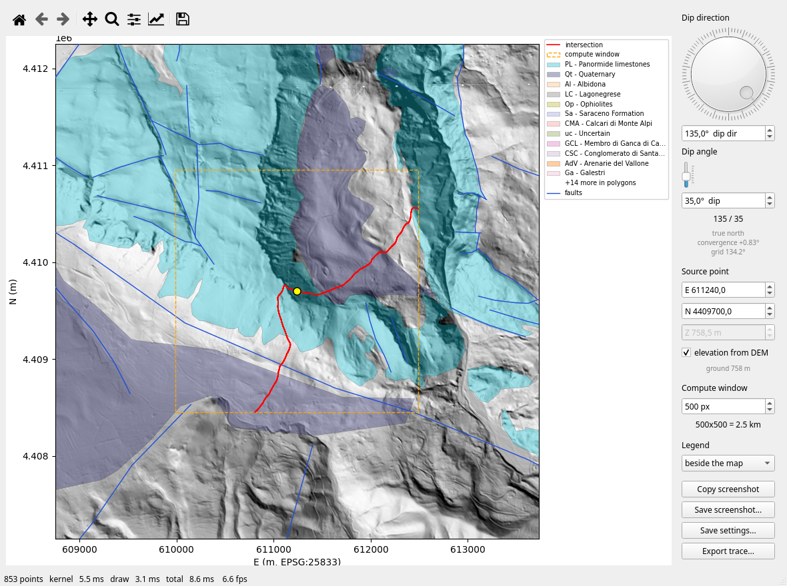

# gSurf

Structural geology you steer by hand: the answer is recomputed on every frame,
not behind a "Calculate" button, so a parameter is something you sweep through
rather than something you guess and check.

```bash
gsurf
```

Three tools so far. **Plane on a DEM** lays an unbounded geological plane on the
topography and shows where it crops out while you turn the dial. **Fold axes**
drags a circular window across a map of bedding attitudes and shows, on a
stereonet that follows it, the girdle the poles spread on and the axis they
turn about. **Sections** drags a section line over the map and redraws the
geology under it as it moves, which turns the section from a result into an
instrument: you find where the fault is by watching where it goes.

They are picked from one launcher, and the tool comes before the question: pick
one and it asks for the sources *it* takes, with what it cannot run without
marked as required — the plane needs a DEM, the fold axes need attitudes, the
section needs a DEM and will take traces, and none is asked for another's. What
you answer is put back the next time, and the session behind it is reopened only
when the answer has changed.



The heavy lifting is done by [misah](https://gitlab.com/mauroalberti/misah), a
Rust crate with Python bindings: its marching-squares kernel returns the chords
where the plane cuts the grid, and this application is the minimum needed to
steer that kernel by hand and see the answer move. Kernel, drawing and frame
rate are reported in the status bar on every frame, so the cost stays visible
while you work.

### Status

`gsurf/tools/` holds the tools, one module each, and the package around them
holds what is not about any one calculation, so that the next tool inherits it
rather than copying it:

- `gsurf/__main__.py`, `gsurf/launcher.py` — the front door: the tools, what
  each one is opened on, and the session kept between them.
- `gsurf/session.py` — the projection, the area, and what has been opened in
  them. The DEM is one of the things in a session and not the frame itself: a
  session can be opened on vector layers alone, taking its CRS and extent from
  their metadata.
- `gsurf/sources.py` — what to open, asked once a tool has been picked. A tool
  declares its slots and which are required; layers are listed and fields read
  off the metadata, so the dialog filters without loading.
- `gsurf/qgis_project.py`, `gsurf/recent.py` — the other two ways of filling a
  slot: a QGIS project read for its layers and the colours they are drawn in
  there, and the list of what has been opened before, kept between runs so a
  morning does not start by naming the same DEM again.
- `gsurf/mapview.py` — the map: hillshade if there is a DEM, vector backdrop,
  navigation, the blitting surface a tool draws its own artists on, and a
  legend whose entries are switches rather than captions — click one and what
  it names comes off the map.
- `gsurf/dem.py`, `gsurf/vectors.py`, `gsurf/convergence.py` — the DEM read by
  windows, the backdrop layers, and grid north against true north.
- `gsurf/attitudes.py`, `gsurf/folds.py`, `gsurf/stereonet.py` — located
  attitudes read strictly, the orientation tensor read as a fold, and an
  equal-area net that redraws while you move. The net is a plain widget and
  owns no window, which is what lets the fold-axis tool float it over the map.
- `gsurf/traces.py`, `gsurf/rotations.py` — the two calculations that read a
  field rather than a point: the attitude a mapped trace and the topography
  under it determine by themselves, and how much a fold axis turns between one
  window and the next, and about what axis. Neither imports Qt, so both can be
  driven from a script and checked against answers known by construction.

The pre-2026 application lived in a `gSurf/` package beside this one and was
removed in 2026-09: it had not run since the rebuild — `pygsf`, `gst` and
`pygmt` for the main window, PyQt5 and Python-2 implicit relative imports for
its intersection GUI, a vendored `apsg` that was never in the tree for its
stereoplot — and nothing outside it imported it. One thing in it is still worth
porting and is a `git show a972c58:gSurf/...` away: the fault-and-slickenline
stereoplot of `stereoplot/`, which reads a rake and a movement sense that
`gsurf/stereonet.py` does not. The topographic profiles of `gSurf.py`, with
attitudes projected onto them, were the other, and are the sections tool now —
rebuilt around the same geogst profiler rather than ported.

Alpha stage. The repository dates from 2012-04-08, was worked on through 2019,
lay dormant for three years, was restarted 2022-11-28, and was rebuilt around
the misah kernel in 2026. Development is on `master` here on GitLab, with the
GitHub repository kept as a mirror and pushed by hand.

### Checks

```bash
python checks/run.py            # off-screen, about forty-five seconds
python checks/run.py --show     # let the windows appear
```

Four hundred and ninety-nine assertions over eleven scripts, each also runnable
on its own. They drive real windows through synthesized mouse events, so Qt is
put in its off-screen mode unless you ask otherwise. `check_sections.py` is 26
of those 47 seconds on its own, most of it opening a 234 Mpx DEM and sampling
bundles off it.

They are checks and not unit tests, in that most of them assert against
something known from outside the code: a fold axis recovered from a synthetic
fold that has one by construction, a right-hand-rule strike agreeing with a dip
direction, a regated field equalling a recomputed one. `check_bare_traces.py`
builds a DEM that *is* a plane of stated attitude and lays a V on it in plan,
so the attitude that comes back off the trace is the one the ground was made
with: 130.7/54.7 against 130/55, and `check_attitude_export.py` writes that same
answer to a file and reads it back to find it still on the trace it came off,
to 10⁻¹⁰ m. `check_interaction.py`
in particular was written to run against either side of a refactor, which is
how the map was lifted out of the intersection tool without changing it — the
same clicks, the same window offsets, the same point counts, digit for digit.

`checks/synthetic.py` is not a check but the bench the frame costs quoted below
were measured on, and builds the synthetic DEM the others use.

### Installing

```bash
pip install -e .
```

Python 3.9+. That is the launcher and **Plane on a DEM**: misah, numpy,
rasterio, PyQt6, matplotlib and pyproj. It also puts a `gsurf` command on the
path, which is the difference between a program and a directory you have to be
standing in.

`misah` is on PyPI, at an alpha version — expect it to move, and it has: 0.2.0a2
is out while this was run against 0.2.0a1. Developed and run on Python 3.13
against numpy 2.5.2, rasterio 1.5.1, PyQt6 6.11.0, matplotlib 3.10.9 and pyproj
3.7.2. The syntax itself stays within 3.9, which is checked and is all the floor
claims: no 3.9 has been run.

Everything else is an extra, because the imports are where they are used rather
than at the top of the file. Without geopandas the plane still starts, draws the
DEM and recomputes the intersection as you drag; what is missing is the layers
underneath, and `Export trace` raising on the way out. Declaring the lot here
would make compulsory at install time what the code went to some trouble to keep
optional at start-up.

```bash
pip install -e ".[vectors]"    # backdrops and export: geopandas, shapely
pip install -e ".[sections]"   # and geogst, for the profiler under the trace
pip install -e ".[folds]"      # and mplstereonet, for the net
pip install -e ".[all]"        # all of it
```

geogst is where the orientation tensor and Woodcock's parameters come from, and
mplstereonet draws the net — `import mplstereonet` is also what registers the
equal-area projection with matplotlib, so inside `folds` it is not itself
optional. The sections tool wants geogst for the profiler that samples the
topography and intersects it with the layers, but not the net. Fitting attitudes
off the traces calls `best_fit_planes` from misah, which the base install
already has.

Neither geogst nor misah is pinned, and geogst is the one to know about: it is
on PyPI at 2.3.1, while what gSurf is developed against is its working tree, in
editable mode, on `dev`. pip does not re-resolve a requirement that is already
satisfied, so nothing above disturbs that; it is `pip install -U` that would
replace it with a release, and that is a thing you ask for rather than one that
happens to you. Where both are already in place, `pip install -e . --no-deps`
installs gSurf and touches nothing else.

### Usage — the launcher

```bash
gsurf
```

or `python -m gsurf` from inside the checkout, which is what there was before
there was anything to install, and which still works.

It opens on the tools and asks nothing yet. Pick one and it asks for what that
tool takes — the plane for a DEM and three optional backdrop slots, the fold
axes for an attitude layer and the two columns its angles are in. The slot it
cannot run without is named `(required)` and coloured, and goes green once it
holds something; `Open` stays refused until it does, and until at least one
source has been named at all, since a session takes its projection and its
extent from what was opened.

What you answer is kept, slot by slot. Going to the other tool re-proposes the
same files, so the second question is usually one keystroke — and if the answer
comes back unchanged, the session itself is handed on as it stands rather than
reopened, which on a large DEM is the whole cost of starting a tool. Closing a
tool brings the launcher back with it still open.

Asking per tool is also what keeps the dialog short. Asked before the tool is
known, it has to cover every source any tool might want: a longer dialog that
says less about the one you picked, and tall enough to push its own buttons off
a short screen. It scrolls now, and can be dragged to any size.

Two of the three can still be started on their own, which is what a repeated run
wants:

```bash
python -m gsurf.tools.intersection
python -m gsurf.tools.fold_axes
```

Bare, each asks for what it needs in the same dialog. With arguments, each takes
them as below and skips the asking. The sections tool has no command line of its
own and is opened from the launcher: it takes five slots, and naming them as
flags would be longer than answering the dialog once.

### Usage — plane on a DEM

```bash
python -m gsurf.tools.intersection dem.tif \
    --polygons geology.gpkg:carbonates \
    --lines    geology.gpkg:faults \
    --points   stations.shp \
    --x 611240 --y 4409700 --window 1000
```

The DEM is the only thing required. The three vector slots — polygons, lines,
points — answer a different question from the calculation: where the plane is
being laid down. In the dialog, the layers offered in each slot are filtered on
geometry read from the file's metadata, so faults never appear among the
polygons and a geometry-less attribute table appears nowhere.

Polygons are coloured per unit, on the field given by `--categories` (default
`code`, `none` to switch it off). The colours are drawn from the layer's
complete list of values rather than from whatever is currently in view, so a
formation keeps its colour as you pan. The legend is cut by outcropping area,
not alphabetically, so the units that make up the map are the ones named.

The legend stands beside the map rather than on it: categorised it runs to some
thirty entries, and inside the frame those cover the corner you were most
likely looking at. The *Legend* box in the panel moves it at any time —
`beside`, `inside`, `hidden` — and `--legend` picks where it starts.
Wherever it goes it belongs to the figure and not to a widget alongside, so
both the saved and the copied screenshot carry it.

**And every entry in it is a switch.** Click one and what it names comes off
the map, click it again and it is back, the entry greyed while it is off. Over
its categories each layer has an entry of its own, in bold, and that one click
takes the whole layer: without it a backdrop of twenty units costs twenty-one
clicks to clear, and clearing it is the thing one actually does. Bold reads as
"a layer" down the whole legend and plain as "a category inside the one
above", which is otherwise not said at all — a run of unit codes does not
announce where one layer's entries end. The categories past the twelfth are
listed as `+N more` and switch together, or they would be unreachable.

`Show all categories`, in the same box, is the way back, and is enabled only
when there is something to bring back. It is not a convenience: hide the
legend with a category switched off and there is nothing left to click, which
without that button is a dead end.

`--settings file.json` reopens a saved orientation. Explicit arguments win over
the file, so `--settings x.json --z 900` is the saved plane at a new elevation.
Files written before the interface changed language still load: the Italian
keys are read as a fallback.

### Usage — fold axes

```bash
python -m gsurf.tools.fold_axes attitudes.gpkg:giaciture \
    --dip-dir Immersione --dip Inclinazione \
    --radius 2000 --dem dem.tif
```

The attitude layer is the only thing required, and it is what the session is
built on: with no DEM the projection and the extent come from the layer itself.
A DEM, if given, is backdrop and nothing else — this calculation never reads an
elevation. `--strike-rhr` reads the azimuth field as a right-hand-rule strike
instead of a dip direction.

Naming the layer and saying what its columns mean are two things, and either
can be left out — whatever is missing is asked for, with the rest filled in
from what was given. Asked, the two angle fields are offered as the layer's
numeric columns and guessed from their names first: on a CARG sheet
`immersione` and `inclinazione` are already selected when the dialog opens. A
field called `strike` also switches the convention, since that is better
evidence of what it holds than the default is. Nothing is guessed silently —
the guess is a selection you can see and change.

Drag the circle across the map. The stereonet follows it, showing the poles of
the bedding inside, the best-fit girdle and the axis they turn about; the panel
gives that axis, Woodcock's K and C, and how many attitudes it came from.

**The net has a window of its own**, floating over the map rather than wedged
into the top of the panel at whatever width the panel allows. It closes by its
own X and reopens from the button in the panel, which is bound to that same
action so the two cannot fall out of step; drag it against the panel and it
docks there instead, if that is where you want it. Closed, it is not redrawn
at all — the frame cost in the status bar goes on measuring what is really on
screen — and on reopening it catches up to the window you are in, not the one
you closed it on.

**The axis is only an axis if the poles form a girdle.** Above K = 1 they
cluster instead, which is a homocline, and the minimum eigenvector of a cluster
is the least determined direction in the data rather than a fold axis. On the
1757 CARG attitudes of the Potenza-Irsina sheet, three windows in four fail
that test — which is the reason the gate exists rather than an argument against
it. `--min-points`, `--max-k` set the thresholds, the panel changes them while
you work, and both they and the verdict go into the saved JSON, because an
answer recorded without the choice that produced it cannot be checked.

A refused axis is drawn in grey rather than hidden. Hiding it would answer "is
this a fold?" by showing nothing, which reads the same as an empty window;
greyed, you watch it turn colour as the window crosses a hinge.

Read the same place at three radii and you see what the window is for. At
590000/4500000 on that sheet: at 1 km ten attitudes and a cluster, at 2 km
312/13 from 38 attitudes with K = 0.59, at 5 km 312/19 from 162 — an axis that
survives a change of scale is a structure, one that does not is a coincidence.

**The grid** asks the same question everywhere at once: a window at every node
of a square grid over the attitudes, `--step` apart. The ticks are drawn at the
cells that pass, coloured by plunge — the plunge is half of what an axis is,
and the length of a bar cannot carry it. `Export grid` writes the cells that
hold data, refused ones included, with their trend in both norths, K, C, n, the
verdict and the thresholds that produced it.

**A field of axes is what made the backdrop worth switching off.** The ticks
are on top by zorder, and twenty tints of geology under them win anyway. The
same *Legend* box is in this panel now — `beside`, `inside`, `hidden`, with
`--legend` for where it starts; the three placements had existed here all
along, but only as that flag, which cannot be changed once the map is open.
Its entries switch what they name, layer by layer or category by category, as
above. The attitudes come off from their own entry too, and so do the ones
inside the window: on a dense survey those dots are what the field has to be
read through. The axis and the window circle do not, being what the hand is
steering — one dragged invisible is worse than one in the way.

**A grid overlaps itself, and the panel says by how much.** A circular window
of radius R laid down every S metres covers πR²/S² cells, so at r = 2000 with a
500 m step every attitude falls into fifty of them and neighbouring cells share
nine tenths of their data. The two controls sit in different groups and their
ratio is never a thing you set, so a field of a thousand axes reads as a
thousand observations when it carries perhaps fifty windows' worth. The line
under the step box names both numbers — `each attitude in ~50 cells; ~50
windows would tile the area` — and they multiply back to the cell count, which
is the point: a denser step buys resolution in the picture and no further
information under it. The same line follows the field into the status bar,
because the count of axes is what gets quoted.

The tiling number is geometry, not statistics. Windows that fail to overlap
are still not independent observations: a fold is continuous, and two windows
that do not touch can be looking at the same one.

The step also decides the cost, so the cost of the step currently typed is
shown beside it, before the button rather than after. On the 1757 CARG
attitudes:

| step | cells | with data | fold axes | time |
|---|---|---|---|---|
| 2000 m | 312 | 246 | 61 | 0.2 s |
| 1000 m | 1104 | 932 | 241 | 0.7 s |
| 500 m | 4140 | 3556 | 948 | 2.6 s |
| 250 m | 16289 | 14025 | 3762 | 9.6 s |

**Moving a threshold re-decides an existing grid without recomputing a single
tensor** — 3 to 7 ms for the whole field, against seconds to build it. K, C and
the count are what the gate reads and they are already there, which is the
payoff of keeping a field as arrays rather than as a picture. On that sheet,
sweeping K from 0.5 to 2.5 takes the field from 369 axes to 2049 out of 3556
occupied cells; how much of a map depends on where a threshold was put is not a
question you can answer by recomputing it four times, and it is not one to
leave unasked.

For the same reason the tensor is computed wherever it is defined — from two
poles up — and not from `--min-points`. Stopping at today's minimum would make
lowering it later impossible without recomputing, silently.

### Usage — sections

Picked from the launcher, which asks for a DEM and offers four more slots:
traces, polygons and lines as backdrop, and located attitudes. Only the DEM is
required — a section of bare topography is a legitimate thing to want.

The traces slot takes a layer whose attitudes are in its columns and equally
one with no attitudes at all, its two angle boxes left on `(none: fit off the
trace)`. A mapped contact carries a plane already, and `Fit from the traces`
below is what reads it out; a CARG `limiti_geologici` sheet, which offers
`OBJECTID` where the dialog asks for dip, opens on that footing. Until
something is read the layer draws nothing in the section — the tick a section
carries is an apparent dip, and there is none yet — and the panel says `not
read` in every attitude cell rather than leaving them blank.

Drag an end of the line on the map and the section redraws under it. The section
is the oldest thing a structural geologist draws and the slowest to iterate on,
because moving it by two hundred metres has always meant redoing it; here it
moves with the mouse, and that is the whole argument for the tool.

**One profile while it moves, the bundle when it stops.** A single profile
recomputes in about 40 ms and a bundle of thirteen in a quarter of a second —
the difference between a line you drag and a line that lurches after you. So the
drag redraws one and the parallel bundle is recomputed on release. The count is
odd, from 1 to 41, because a central bundle has a middle and the profiler raises
without one; the spin box refuses an even number itself rather than letting it
reach code that would abort the application from inside a Qt slot.

**The trace drawn, never the trace sampled.** An intersection costs profile
segments times trace vertices, and a section line stored densified to DEM step —
1276 vertices over 6.4 km, which is how they come out of QGIS — costs 1275 times
what the two-point trace costs and finds exactly the same crossings. What goes
to the profiler is the two ends and nothing between them; the densification is
for sampling the topography, and the sampler does its own.

**Three windows, not one window with docks**: the map, the section and the trace
records are top-level windows in their own right, so the section can be given a
screen and the size a section wants rather than the strip a dock leaves it. They
are parented to the map, which is what has Qt destroy them with the tool, and
`Windows` on the map's menu bar brings back one that was closed. Beside the
panels stands a legend naming the units the bundle actually goes through, in the
colours it draws them in — the same key as the map's, which is the point of
handing the project's palette to the profiler — then the line categories it
meets, then the attitudes.

**What is remembered divides into habits and places.** A section is arrived at
rather than specified: you drag until it crosses the thing you are after, and
closing the window used to throw that away and come up west-to-east through the
middle again. So the trace, the framing, the bundle, the reach and whether the
legend is up are written on the way out. But how many profiles at what spacing
is a way of working and carries to whatever opens next, while a trace is metres
in a projection and means somewhere else under another one — so places come back
only over the source they were written on.

**How far a measurement reaches is a judgement, and it is made here.** A plane
fitted to a trace owns that trace; a compass reading taken at one outcrop owns a
point, and how much of the fault it speaks for — fifty metres where it is a
local break, the whole kilometre where the surface has been walked — is a
judgement about that fault and not a property of the layer. The `reach` column
in the trace panel is that control, and `crosses` beside it is why the panel
sits next to the section rather than in a dialog: fifty-six planes on a
nine-kilometre line produce three crossings, and which three changes as the line
moves.

**Nothing is written back to the layer.** A source file is a record of what was
surveyed and a section is an argument about it, so the argument is saved as its
own assertion — `Write curation...` writes a gstruct fragment, one entry per
record changed, over a layer left exactly as it was found. Re-reading it
tomorrow gives the survey back, not yesterday's opinion of it.

**`Read curation...` is the other half of that**, and without it the first half
is a file nobody opens. It lays a `.gstruct` over the records on show: what it
says about a structure it names, and nothing about one it does not. A plane in
it arrives as a record *beside* the one already there rather than over it — a
measurement taken at an outcrop does not delete the one the survey recorded —
and the report says how many of its claims found anything, because a curation
whose idents match nothing looks exactly like one that worked.

The traces slot takes a `.gstruct` directly too, which is the same reader coming
in through the other door: one record per plane the file carries, the structure
`kind` as the category, a fit's own interval as its span, and a trace carrying
no plane offered to `Fit from the traces` like any other. What that buys is the
anchor. A GeoPackage has nowhere to put `@x,y`, so an export flattens it to a
progressive — and a progressive is a reading off a ruler that the projection and
the digitising both move. Read here, it is re-derived against the geometry in
hand: `check_gstruct.py` opens one file in two projections and once more with
its trace redrawn, and the measurement stays on the same ground each time while
the progressive moves 1.35 m between UTM zones. `gsurf/curation.py` is the only
module that imports gstruct, which is on no index and so cannot be declared in
`pyproject.toml`; install it from its own repository, or the two buttons say so
plainly instead of raising.

**`Fit from the traces` reads the attitudes off the map instead of the
columns.** A contact crossing relief is a plane already: where the line goes in
plan and where the ground is along it are three dimensions, and `gsurf/traces.py`
fits an attitude to a window of that curve, sweeping the window length per trace
to find the length over which the trace holds one orientation. It is reversible,
and the button says which way it is pointing, because this is a claim to be
compared and not an improvement to be applied — a column is what somebody wrote
down at an outcrop, a fit is what the map plus the DEM imply, and which is right
is often the question the section is being drawn to answer.

What comes back is not one record per trace. A contact that holds a different
plane over two stretches gives two, and one that never turns enough gives none
and leaves the section, so the fit reports rather than leaving it to be noticed:
on 56 mapped faults at Monte Alpi it is 11 stretches on 10 of them, 3 per cent
of the walked length readable, in 0.86 s. Against a synthetic plane at 170/40
cut into a corrugated DEM the fit comes back within 0.1°; against the surveyed
columns on that real layer the per-trace median is 4.3° where chance would be
51 — but ten of those eleven records were themselves derived from trace and DEM
by an earlier script, so that second number is a reproduction and not an
independent test.

**A whole mapped sheet is where the difference shows.** The CARG
`limiti_geologici` of the southern Apennines is 24717 contacts with no attitude
on any of them, 22531 of them inside the DEM; fitted, they give **12254
stretches on 7116 traces**, and **31 per cent of the walked length is readable**
against the 3 per cent of the curated faults. That ratio is not a better day at
the same job. A fault mapped at this scale is steep, and the trace of a
subvertical plane *is* its strike, so it fails the first stage for a reason
rather than by bad luck; a stratigraphic contact crosses relief and draws the V
that carries a dip. The layer nobody could open was the one with most to say.

**A fit that is stopped is not applied.** On a curated fault layer the fit is a
fifth of a second and there is nothing to stop; on a whole mapped sheet it runs
for minutes, so above two hundred traces it gets a progress dialog with a Stop
on it. Stopping throws the partial answer away rather than keeping it, and says
so. What had been read by then is the first N traces in file order, which is a
corner of a sheet and not a sample of one — and unlike a refusal it would not
announce itself.

**But a whole sheet fitted is more than the section can drag.** The fit itself
is **160 s** for those 22531 contacts and the table takes the 12254 records it
gives back in half a second; rebuilding the bundle over them is **15 to 19 s**,
and that is the cost of every release of the mouse afterwards, against the
quarter of a second the tool is built around. So fitting a sheet entire is a
thing to do once and look at.

**`Near the section only` is the cut that makes it something to work in.** It
keeps the records whose trace comes within the bundle's own width plus one more
profile's spacing — a fact about the section rather than another number to set,
and the right size by construction: room to drag the trace or to widen the
bundle by one without having to cut again. A 19 km section with five profiles
500 m apart takes those 22531 contacts down to **156**, in 60 ms. The fit on
them is **1.2 s** instead of 160, and the bundle **0.3 s** instead of 15.

**And the section that comes out is the same one, tick for tick.** Nine
crossings either way — the same profile of the bundle, the same progressive to
the millimetre, the same apparent dip to four decimals off the same source
plane. That is the claim worth making about a selection, and it is the one the
timings are worth nothing without: what the cut removes is what the section
could never have crossed, so it buys two orders of magnitude and costs nothing
in the answer.

A trace is kept whole or left out, never trimmed at the boundary — cutting it
there would put an endpoint on it where a decision stopped rather than where a
contact does, and the fit would go on to read a plane off that corner. The
records are the same objects, so an attitude typed in by hand or a record
switched off survives the cut and is still there when the layer comes back. A
fit does not: it is a claim about the set of records it ran on, and a different
set ends it, which the box says in both directions.

**The other cut named here, by `Tipo`, is deliberately not built.** On this
sheet it would take those 156 records to 97 — the stratigraphic contacts, which
are the ones that draw a readable V. Set against 22531 → 156 for the spatial
cut, that is a factor of 1.6 against a factor of 144, over a UI that would have
to enumerate 27 free-text categories up to 130 characters long. The two-stage
gate already refuses the faults, for the reason stated above, and refusing them
a second time by name costs 0.3 s of fitting.

**`Export attitudes...` is how a computed attitude leaves the tool.** A fit that
exists only on a screen is not a result, and the curation file will not carry
one — it declares in its own header that every line in it is a human assertion,
and a fit is a derivative. So the fits leave as what they are: a point layer,
one point per record, written where the attitude was actually read. For a fit
that is the middle of the stretch its window held on, interpolated inside the
segment it falls in rather than snapped to a vertex; on a trace digitised every
40 m, snapping would put the point up to 20 m from the reading, which is the
size of the thing being located.

Each point carries the stretch it holds over, the window length it was read
with — a contact read over 150 m and over 900 m are two different claims about
it — the elevation from the DEM rather than from the line's own third value,
and the gate that admitted it, `min_lever` included, which `from_traces`
measures off the layer and so cannot be recovered from a default. Verdicts that
cannot be checked against the rule that produced them are a picture rather than
a measurement.

This is where the per-stretch fit stops being an internal detail. At Monte Alpi
fault F0241 comes out as two points 163 m apart, 329.6/69.6 at 1182 m and
332.6/61.1 at 1242 m, holding over 75 and 150 m — one mapped fault, two
attitudes, each somewhere. Columns are within the ten characters a shapefile
allows, and GeoPackage and shapefile both round-trip.

**What this still does not do.** The floor that decides whether a window turns
enough to determine a plane is a declared choice, not a measured one: the
readable share slides smoothly at every window length, with no knee to put it
at, and the traces themselves are self-affine — sagitta against baseline goes
as the 0.9 power on these lines, where independent digitising jitter would give
0 — so there is no pen width to derive it from, and the code refuses to invent
one. It matters more now than it did: the share of a bare sheet that comes back
readable is a number that threshold sets.

### Things worth knowing

**Dip direction is true azimuth**, as a compass reads it once declination is
corrected. The DEM is on the projection's grid, and the two norths do not
agree: meridian convergence is subtracted before the kernel is called, and
shown under the attitude. In the southern Apennines in EPSG:25833 it runs
between +0.41° and +1.04°, which over five kilometres of trace is up to 91 m —
twenty times the DEM cell. It is measured rather than taken from a formula: a
100 m step along true north, then read what azimuth that step has on the grid.
Eight microseconds, and it holds for any projection.

**The DEM is never loaded.** The background is a decimated overview; the kernel
reads one full-resolution window at a time, and `--window` sets its side in
cells. A 234 Mpx mosaic therefore costs the same per frame as a small crop,
where loading it would have been 2.5 GB in float64.

**Give your DEM overviews.** Without them the initial decimation has to read
the whole raster. On a 234 Mpx mosaic that is the difference between 3.5 s and
0.35 s at startup:

```bash
gdaladdo -r average dem.tif 2 4 8 16
```

**The source point can leave the ground.** Its three components are
independent: what you omit the DEM decides — no `--x`/`--y` puts it at the
centre, no `--z` takes the ground elevation. But a `z` you give stays given,
and survives dragging the point, which is how a plane is laid on a horizon
passing above or below today's topography. The *elevation from DEM* checkbox makes
and breaks the tie at any time, and both exports record which way it was along
with the ground elevation underneath.

**Exports carry their own frame.** Both azimuths (true and grid) and both
coordinate pairs (projected and geographic) go into the JSON and the shapefile.
Coordinates in a single EPSG are unusable outside it, and the `.prj` is the
file that goes missing first. A fold axis is written the same way: true
azimuth, grid azimuth and the convergence between them.

**A horizontal bed has no dip direction.** The fold-axis tool reads the dip first
and only then the azimuth, because the dip is what decides whether the azimuth
means anything: at zero dip the field is not read at all. That is not
pedantry — the CARG sheets write 999 there, and a reader that took it at face
value would drop every horizontal bed on the map, or worse, keep it as a
bearing. Whatever is dropped and why is printed on the way in, never silently.

**And 360 is north.** The admissible range is closed at both ends, not the
half-open one a normalised azimuth lives in: on the Marsico Nuovo sheet ten
attitudes are written 360 and not one is written 0, so a half-open rule threw
away every north-dipping bed there and called them errors. It cost nothing on
the Potenza-Irsina sheet, which happens to contain no 360 at all — which is the
argument for trying a reader on a second survey before believing it.

### Performance

Measured on the 234 Mpx 5 m mosaic, dragging the dial, PyQt6 with matplotlib
blitting:

| window | ms/frame | fps |
|---|---|---|
| 500² (2.5 km) | 10.9 | 92 |
| 1000² (5 km) | 26.6 | 38 |
| 2000² (10 km) | 95.7 | 11 |

Real time holds to 1000². At 2000² the kernel alone takes most of the frame,
and decimation or tiling would be needed. On the same plane and grid the misah
kernel runs about 77× the pure-Python equivalent in geogst, which is what makes
dragging possible at all.

Fold axes are not a kernel problem. Dragging the window across the 1757 CARG
attitudes costs 4.5 ms a frame, of which the search is 0.1 ms and the
orientation tensor 0.8; the rest is drawing two canvases. The tensor is
geogst's, called once per frame — 0.39 ms for a window of 20 poles, 0.99 for
68, 4.2 for 313 — which is affordable at a frame and is why there is no second
copy of that mathematics here.

The grid was expected to be where that stopped being true, and it is not. A
16289-cell field takes 9.6 s, of which geogst is 6.0 and the search 0.9: slow
enough to want a progress bar and a Stop button, nowhere near slow enough to
justify a second implementation of the orientation tensor. A vectorised one
still belongs upstream in geogst if it is ever written, but nothing here is
waiting for it.

The search stayed a plain scan for the same reason. A KD-tree does the 16289
windows in 0.046 s against 0.89 — nineteen times faster, and 13% of a field —
which does not buy a dependency. It would if the tensor stopped dominating,
which is the opposite of what happened.

Sections are geogst's profiler, and it is fast enough to drag one profile and
not thirteen: about 40 ms for a single and a quarter of a second for a bundle of
thirteen, which is what the split between the drag and the release is paying
for. Fitting attitudes off the traces is not a per-frame cost at all — 56 traces
swept at five window lengths take 0.86 s, once, on a button.

A bare sheet is the same 5.6 ms a trace and simply has more of them. Reading
the 24717 contacts of `limiti_geologici` into records costs 1.6 s, and the
table takes all of them in 0.4 s; the fit over the 22531 inside the DEM is
130 s, and what follows it is 17 s of rebuilding the bundle over the 12254
records that came back. That last number is the one that decides how the tool
is used, not the first: it is paid again on every release of the mouse.

Reading those contacts used to cost 9.3 s rather than 1.6, of which 8.3 was
`Ln.length_2d` in geogst building two `Point` objects and calling
`np.linalg.norm` once per segment — 526311 of them. It is computed on the
coordinate array now, 19× faster and agreeing with the old loop to 2×10⁻¹¹ m
over 13080 km of line. Not a gSurf change: it is in geogst, which gSurf runs
from the working tree.

### Related

- [misah](https://gitlab.com/mauroalberti/misah) — the Rust kernels
- [geogst](https://gitlab.com/mauroalberti/geogst) — types, CRS, orientation
  statistics and plots
- [qgSurf](https://gitlab.com/mauroalberti/qgSurf) — the QGIS plug-in, whose
  plane/DEM intersection this replaces with an interactive one

### License

MIT, and the copyright runs from 2012 because that is when the first commit
here is dated — the repository is a good deal older than the package that
installs it. See [LICENSE](LICENSE).
