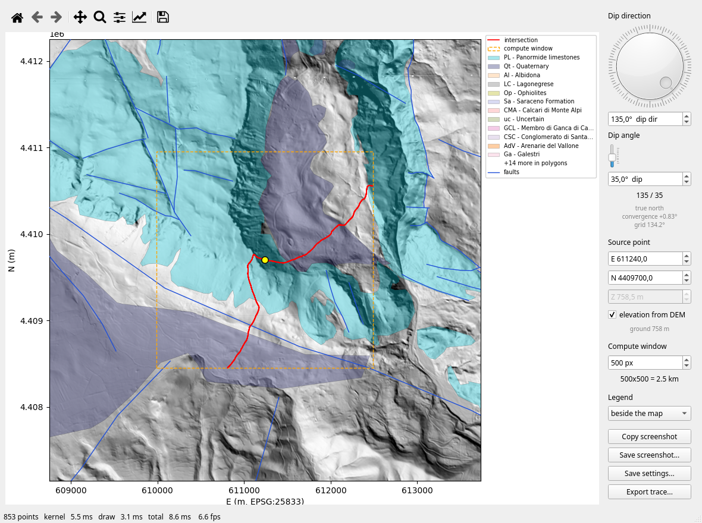

# gSurf

Structural geology you steer by hand: the answer is recomputed on every frame,
not behind a "Calculate" button, so a parameter is something you sweep through
rather than something you guess and check.

```bash
gsurf
```

Four tools so far. **Plane on a DEM** lays an unbounded geological plane on the
topography and shows where it crops out while you turn the dial. **Fold axes**
drags a circular window across a map of bedding attitudes and shows, on a
stereonet that follows it, the girdle the poles spread on and the axis they
turn about. **Sections** drags a section line over the map and redraws the
geology under it as it moves, which turns the section from a result into an
instrument: you find where the fault is by watching where it goes. **Trace
editor** opens a `.gstruct` on the map and draws, along each trace, what is
actually in force at every metre of it and where that comes from — then lets you
write the next line of the file against the picture.

They are picked from one launcher, and the tool comes before the question: pick
one and it asks for the sources *it* takes, with what it cannot run without
marked as required — the plane needs a DEM, the fold axes need attitudes, the
section needs a DEM and will take traces, the editor needs the file and will
take a DEM to put under it, and none is asked for another's. What you answer is
put back the next time, and the session behind it is reopened only when the
answer has changed.



The heavy lifting is done by [misah](https://gitlab.com/mauroalberti/misah), a
Rust crate with Python bindings: its marching-squares kernel returns the chords
where the plane cuts the grid, and this application is the minimum needed to
steer that kernel by hand and see the answer move. Kernel, drawing and frame
rate are reported in the status bar on every frame, so the cost stays visible
while you work.

### Status

`gsurf/tools/` holds the tools, one module each, and the package around them
holds what is not about any one calculation, so that the next tool inherits it
rather than copying it:

- `gsurf/__main__.py`, `gsurf/launcher.py` — the front door: the tools, what
  each one is opened on, and the session kept between them.
- `gsurf/session.py` — the projection, the area, and what has been opened in
  them. The DEM is one of the things in a session and not the frame itself: a
  session can be opened on vector layers alone, taking its CRS and extent from
  their metadata.
- `gsurf/sources.py` — what to open, asked once a tool has been picked. A tool
  declares its slots and which are required; layers are listed and fields read
  off the metadata, so the dialog filters without loading.
- `gsurf/qgis_project.py`, `gsurf/recent.py` — the other two ways of filling a
  slot: a QGIS project read for its layers and the colours they are drawn in
  there, and the list of what has been opened before, kept between runs so a
  morning does not start by naming the same DEM again.
- `gsurf/mapview.py` — the map: hillshade if there is a DEM, vector backdrop,
  navigation, the blitting surface a tool draws its own artists on, and a
  legend whose entries are switches rather than captions — click one and what
  it names comes off the map.
- `gsurf/windows.py` — a tool is one entry in the taskbar and several windows
  on the screen: the map, and the panels given windows of their own so they can
  go on another monitor. What the two tools that do this share is where the
  windows were left, who brings them back, and the parent that keeps closing one
  from taking the application down.
- `gsurf/dem.py`, `gsurf/vectors.py`, `gsurf/convergence.py` — the DEM read by
  windows, the backdrop layers, and grid north against true north.
- `gsurf/attitudes.py`, `gsurf/folds.py`, `gsurf/stereonet.py` — located
  attitudes read strictly, the orientation tensor read as a fold, and an
  equal-area net that redraws while you move. The net is a plain widget and
  owns no window, which is what lets the fold-axis tool float it over the map.
- `gsurf/traces.py`, `gsurf/rotations.py` — the two calculations that read a
  field rather than a point: the attitude a mapped trace and the topography
  under it determine by themselves, and how much a fold axis turns between one
  window and the next, and about what axis. Neither imports Qt, so both can be
  driven from a script and checked against answers known by construction.
- `gsurf/sections.py` — a section as a file: the two ends, the bundle and the
  reach, written where the data is and opened again later, reprojected onto
  whatever is open now. Also the two readers that check a stored section's
  numbers, kept here because there are two doors into the tool — the conf it
  writes on the way out and a file somebody names — and a bound enforced at one
  of them only is not a bound. No Qt in it, so a saved section can be opened
  from a script.
- `gsurf/curation.py` — the boundary with
  [gstruct](https://gitlab.com/mauroalberti/gstruct), the text format the
  assertions are written in. The only module that imports it, so that
  everything the two projects have to agree about — which way a normal points,
  what the axes are called, where one structure's lines start and stop — is
  agreed in one file. A dataset arrives as records, a curation lays over records
  already open, records go back out as a curation of the differences, and a file
  is held as the text it is for the editor to splice.
- `gsurf/imports.py` — the way into that format from a mapped layer, which is
  the direction neither script in the gstruct repository runs: `export_gsurf.py`
  goes out to a GeoPackage, and `export_geology.py` comes in from one survey's
  own columns. A line layer is asked what its columns mean and written out as
  structures with their paths — a transcript and not a curation, since there is
  no source file for it to be laid over. The four rules FORMAT.md sets for an
  importer are the shape of the module: the source string kept beside anything
  normalised from it, what the source does not say written `unknown` with a
  reason, nothing dropped that could be carried, and no synonyms turned into
  grades. Given a DEM it also reads a plane off the topography along each trace,
  one `fit` between anchors per stretch the gate holds — the producer FORMAT.md
  says is missing rather than the format — and given a point layer it attaches
  the measurements that fall near a trace and keeps the rest as `observation`s
  with the distance that refused them.

The pre-2026 application lived in a `gSurf/` package beside this one and was
removed in 2026-09: it had not run since the rebuild — `pygsf`, `gst` and
`pygmt` for the main window, PyQt5 and Python-2 implicit relative imports for
its intersection GUI, a vendored `apsg` that was never in the tree for its
stereoplot — and nothing outside it imported it. One thing in it is still worth
porting and is a `git show a972c58:gSurf/...` away: the fault-and-slickenline
stereoplot of `stereoplot/`, which reads a rake and a movement sense that
`gsurf/stereonet.py` does not. The topographic profiles of `gSurf.py`, with
attitudes projected onto them, were the other, and are the sections tool now —
rebuilt around the same geogst profiler rather than ported.

Alpha stage. The repository dates from 2012-04-08, was worked on through 2019,
lay dormant for three years, was restarted 2022-11-28, and was rebuilt around
the misah kernel in 2026. Development is on `master` here on GitLab, with the
GitHub repository kept as a mirror.

The mirror is not pushed by hand: `origin` carries two push URLs, GitLab first
and GitHub second, so one `git push` reaches both while fetching stays on
GitLab alone. Worth knowing if you clone this and wonder why your own push goes
one place — the URLs are in the clone's config, not in the tree — and worth
knowing in the other direction too, because a push that fails on the second URL
still succeeded on the first, exits non-zero about it, and leaves
`origin/master` pointing at the commit anyway: afterwards `git status` reads
clean whether or not the mirror got it. The `github` remote is kept alongside
for that, `git fetch github` and a range against `github/master` being the only
thing that answers it.

### Checks

```bash
python checks/run.py            # off-screen
python checks/run.py --show     # let the windows appear
```

One script per area, each also runnable on its own, and each printing its
assertions one to a line with the number that satisfied them — which is where to
read what is covered, rather than from a total here that a single commit puts out
of date. They drive real windows through synthesized mouse events, so Qt is put
in its off-screen mode unless you ask otherwise. Most of the wall clock is
`check_sections.py`, and most of that is opening a 234 Mpx DEM and sampling
bundles off it.

They are checks and not unit tests, in that most of them assert against
something known from outside the code: a fold axis recovered from a synthetic
fold that has one by construction, a right-hand-rule strike agreeing with a dip
direction, a regated field equalling a recomputed one. `check_bare_traces.py`
builds a DEM that *is* a plane of stated attitude and lays a V on it in plan,
so the attitude that comes back off the trace is the one the ground was made
with: 130.7/54.7 against 130/55, and `check_attitude_export.py` writes that same
answer to a file and reads it back to find it still on the trace it came off,
to 10⁻¹⁰ m. `check_section_files.py` saves a section, reopens it, and asks for
the bundle back line for line — then writes the same one out in three other
projections to find the two ends landing within nanometres and the middle of the
line moving by the 2 m the geometry says it must. `check_interaction.py`
in particular was written to run against either side of a refactor, which is
how the map was lifted out of the intersection tool without changing it — the
same clicks, the same window offsets, the same point counts, digit for digit.

`checks/synthetic.py` is not a check but the bench the frame costs quoted below
were measured on, and builds the synthetic DEM the others use.

### Installing

```bash
pip install -e .
```

Python 3.9+. That is the launcher and **Plane on a DEM**: misah, numpy,
rasterio, PyQt6, matplotlib and pyproj. It also puts a `gsurf` command on the
path, which is the difference between a program and a directory you have to be
standing in.

`misah` is on PyPI at an alpha version — expect it to move, and it has: what is
installed here and what is current there have already fallen a release apart,
which is what an alpha means and is why nothing here pins it. Developed and run
on Python 3.13, against the numpy, rasterio, PyQt6, matplotlib and pyproj that
were current in 2026-09 — a snapshot of what has actually been exercised, and
not a floor. The floor is the syntax, which stays within 3.9 and is checked;
no 3.9 has been run.

Everything else is an extra, because the imports are where they are used rather
than at the top of the file. Without geopandas the plane still starts, draws the
DEM and recomputes the intersection as you drag; what is missing is the layers
underneath, and `Export trace` raising on the way out. Declaring the lot here
would make compulsory at install time what the code went to some trouble to keep
optional at start-up.

```bash
pip install -e ".[vectors]"    # backdrops and export: geopandas, shapely
pip install -e ".[sections]"   # and geogst, for the profiler under the trace
pip install -e ".[folds]"      # and mplstereonet, for the net
pip install -e ".[all]"        # all of it
```

geogst is where the orientation tensor and Woodcock's parameters come from, and
mplstereonet draws the net — `import mplstereonet` is also what registers the
equal-area projection with matplotlib, so inside `folds` it is not itself
optional. The sections tool wants geogst for the profiler that samples the
topography and intersects it with the layers, but not the net. Fitting attitudes
off the traces calls `best_fit_planes` from misah, which the base install
already has.

Neither geogst nor misah is pinned, and geogst is the one to know about: it is
on PyPI at a release, while what gSurf is developed against is its working tree,
in editable mode, on `dev`. pip does not re-resolve a requirement that is already
satisfied, so nothing above disturbs that; it is `pip install -U` that would
replace it with a release, and that is a thing you ask for rather than one that
happens to you. Where both are already in place, `pip install -e . --no-deps`
installs gSurf and touches nothing else.

### Usage — the launcher

```bash
gsurf
```

or `python -m gsurf` from inside the checkout, which is what there was before
there was anything to install, and which still works.

It opens on the tools and asks nothing yet. Pick one and it asks for what that
tool takes — the plane for a DEM and three optional backdrop slots, the fold
axes for an attitude layer and the two columns its angles are in. The slot it
cannot run without is named `(required)` and coloured, and goes green once it
holds something; `Open` stays refused until it does, and until at least one
source has been named at all, since a session takes its projection and its
extent from what was opened.

What you answer is kept, slot by slot. Going to the other tool re-proposes the
same files, so the second question is usually one keystroke — and if the answer
comes back unchanged, the session itself is handed on as it stands rather than
reopened, which on a large DEM is the whole cost of starting a tool. Closing a
tool brings the launcher back with it still open.

Asking per tool is also what keeps the dialog short. Asked before the tool is
known, it has to cover every source any tool might want: a longer dialog that
says less about the one you picked, and tall enough to push its own buttons off
a short screen. It scrolls now, and can be dragged to any size.

Under the tools is `Import — lines to .gstruct`, which is not one: it opens no
DEM, draws no map and hands back no window. It is there because the trace editor
takes a `.gstruct` and nothing else, which is right — there is nothing in a
mapped layer to edit — and which left a layer with no way in at all. It reads a
line layer, asks what its columns mean, writes the file, and remembers it in the
`traces` slot, so the editor proposes it next without anybody browsing for it.

Two of the three can still be started on their own, which is what a repeated run
wants:

```bash
python -m gsurf.tools.intersection
python -m gsurf.tools.fold_axes
```

Bare, each asks for what it needs in the same dialog. With arguments, each takes
them as below and skips the asking. The sections tool has no command line of its
own and is opened from the launcher: it takes five slots, and naming them as
flags would be longer than answering the dialog once.

### Usage — plane on a DEM

```bash
python -m gsurf.tools.intersection dem.tif \
    --polygons geology.gpkg:carbonates \
    --lines    geology.gpkg:faults \
    --points   stations.shp \
    --x 611240 --y 4409700 --window 1000
```

The DEM is the only thing required. The three vector slots — polygons, lines,
points — answer a different question from the calculation: where the plane is
being laid down. In the dialog, the layers offered in each slot are filtered on
geometry read from the file's metadata, so faults never appear among the
polygons and a geometry-less attribute table appears nowhere.

Polygons are coloured per unit, on the field given by `--categories` (default
`code`, `none` to switch it off). The colours are drawn from the layer's
complete list of values rather than from whatever is currently in view, so a
formation keeps its colour as you pan. The legend is cut by outcropping area,
not alphabetically, so the units that make up the map are the ones named.

The legend stands beside the map rather than on it: categorised it runs to some
thirty entries, and inside the frame those cover the corner you were most
likely looking at. The *Legend* box in the panel moves it at any time —
`beside`, `inside`, `hidden` — and `--legend` picks where it starts.
Wherever it goes it belongs to the figure and not to a widget alongside, so
both the saved and the copied screenshot carry it.

**And every entry in it is a switch.** Click one and what it names comes off
the map, click it again and it is back, the entry greyed while it is off. Over
its categories each layer has an entry of its own, in bold, and that one click
takes the whole layer: without it a backdrop of twenty units costs twenty-one
clicks to clear, and clearing it is the thing one actually does. Bold reads as
"a layer" down the whole legend and plain as "a category inside the one
above", which is otherwise not said at all — a run of unit codes does not
announce where one layer's entries end. The categories past the twelfth are
listed as `+N more` and switch together, or they would be unreachable.

`Show all categories`, in the same box, is the way back, and is enabled only
when there is something to bring back. It is not a convenience: hide the
legend with a category switched off and there is nothing left to click, which
without that button is a dead end.

`--settings file.json` reopens a saved orientation. Explicit arguments win over
the file, so `--settings x.json --z 900` is the saved plane at a new elevation.
Files written before the interface changed language still load: the Italian
keys are read as a fallback.

### Usage — fold axes

```bash
python -m gsurf.tools.fold_axes attitudes.gpkg:giaciture \
    --dip-dir Immersione --dip Inclinazione \
    --radius 2000 --dem dem.tif
```

The attitude layer is the only thing required, and it is what the session is
built on: with no DEM the projection and the extent come from the layer itself.
A DEM, if given, is backdrop and nothing else — this calculation never reads an
elevation. `--strike-rhr` reads the azimuth field as a right-hand-rule strike
instead of a dip direction.

Naming the layer and saying what its columns mean are two things, and either
can be left out — whatever is missing is asked for, with the rest filled in
from what was given. Asked, the two angle fields are offered as the layer's
numeric columns and guessed from their names first: on a CARG sheet
`immersione` and `inclinazione` are already selected when the dialog opens. A
field called `strike` also switches the convention, since that is better
evidence of what it holds than the default is. Nothing is guessed silently —
the guess is a selection you can see and change.

Drag the circle across the map. The stereonet follows it, showing the poles of
the bedding inside, the best-fit girdle and the axis they turn about; the panel
gives that axis, Woodcock's K and C, and how many attitudes it came from.

**The net has a window of its own**, floating over the map rather than wedged
into the top of the panel at whatever width the panel allows. It closes by its
own X and reopens from the button in the panel, which is bound to that same
action so the two cannot fall out of step; drag it against the panel and it
docks there instead, if that is where you want it. Closed, it is not redrawn
at all — the frame cost in the status bar goes on measuring what is really on
screen — and on reopening it catches up to the window you are in, not the one
you closed it on.

**The axis is only an axis if the poles form a girdle.** Above K = 1 they
cluster instead, which is a homocline, and the minimum eigenvector of a cluster
is the least determined direction in the data rather than a fold axis. On the
1757 CARG attitudes of the Potenza-Irsina sheet, three windows in four fail
that test — which is the reason the gate exists rather than an argument against
it. `--min-points`, `--max-k` set the thresholds, the panel changes them while
you work, and both they and the verdict go into the saved JSON, because an
answer recorded without the choice that produced it cannot be checked.

A refused axis is drawn in grey rather than hidden. Hiding it would answer "is
this a fold?" by showing nothing, which reads the same as an empty window;
greyed, you watch it turn colour as the window crosses a hinge.

Read the same place at three radii and you see what the window is for. At
590000/4500000 on that sheet: at 1 km ten attitudes and a cluster, at 2 km
312/13 from 38 attitudes with K = 0.59, at 5 km 312/19 from 162 — an axis that
survives a change of scale is a structure, one that does not is a coincidence.

**The grid** asks the same question everywhere at once: a window at every node
of a square grid over the attitudes, `--step` apart. The ticks are drawn at the
cells that pass, coloured by plunge — the plunge is half of what an axis is,
and the length of a bar cannot carry it. `Export grid` writes the cells that
hold data, refused ones included, with their trend in both norths, K, C, n, the
verdict and the thresholds that produced it.

**A field of axes is what made the backdrop worth switching off.** The ticks
are on top by zorder, and twenty tints of geology under them win anyway. The
same *Legend* box is in this panel now — `beside`, `inside`, `hidden`, with
`--legend` for where it starts; the three placements had existed here all
along, but only as that flag, which cannot be changed once the map is open.
Its entries switch what they name, layer by layer or category by category, as
above. The attitudes come off from their own entry too, and so do the ones
inside the window: on a dense survey those dots are what the field has to be
read through. The axis and the window circle do not, being what the hand is
steering — one dragged invisible is worse than one in the way.

**A grid overlaps itself, and the panel says by how much.** A circular window
of radius R laid down every S metres covers πR²/S² cells, so at r = 2000 with a
500 m step every attitude falls into fifty of them and neighbouring cells share
nine tenths of their data. The two controls sit in different groups and their
ratio is never a thing you set, so a field of a thousand axes reads as a
thousand observations when it carries perhaps fifty windows' worth. The line
under the step box names both numbers — `each attitude in ~50 cells; ~50
windows would tile the area` — and they multiply back to the cell count, which
is the point: a denser step buys resolution in the picture and no further
information under it. The same line follows the field into the status bar,
because the count of axes is what gets quoted.

The tiling number is geometry, not statistics. Windows that fail to overlap
are still not independent observations: a fold is continuous, and two windows
that do not touch can be looking at the same one.

The step also decides the cost, so the cost of the step currently typed is
shown beside it, before the button rather than after. On the 1757 CARG
attitudes:

| step | cells | with data | fold axes | time |
|---|---|---|---|---|
| 2000 m | 312 | 246 | 61 | 0.2 s |
| 1000 m | 1104 | 932 | 241 | 0.7 s |
| 500 m | 4140 | 3556 | 948 | 2.6 s |
| 250 m | 16289 | 14025 | 3762 | 9.6 s |

**Moving a threshold re-decides an existing grid without recomputing a single
tensor** — 3 to 7 ms for the whole field, against seconds to build it. K, C and
the count are what the gate reads and they are already there, which is the
payoff of keeping a field as arrays rather than as a picture. On that sheet,
sweeping K from 0.5 to 2.5 takes the field from 369 axes to 2049 out of 3556
occupied cells; how much of a map depends on where a threshold was put is not a
question you can answer by recomputing it four times, and it is not one to
leave unasked.

For the same reason the tensor is computed wherever it is defined — from two
poles up — and not from `--min-points`. Stopping at today's minimum would make
lowering it later impossible without recomputing, silently.

### Usage — sections

Picked from the launcher, which asks for a DEM and offers four more slots:
traces, polygons and lines as backdrop, and located attitudes. Only the DEM is
required — a section of bare topography is a legitimate thing to want.

The traces slot takes a layer whose attitudes are in its columns and equally
one with no attitudes at all, its two angle boxes left on `(none: fit off the
trace)`. A mapped contact carries a plane already, and `Fit from the traces`
below is what reads it out; a CARG `limiti_geologici` sheet, which offers
`OBJECTID` where the dialog asks for dip, opens on that footing. Until
something is read the layer draws nothing in the section — the tick a section
carries is an apparent dip, and there is none yet — and the panel says `not
read` in every attitude cell rather than leaving them blank.

Drag an end of the line on the map and the section redraws under it. The section
is the oldest thing a structural geologist draws and the slowest to iterate on,
because moving it by two hundred metres has always meant redoing it; here it
moves with the mouse, and that is the whole argument for the tool.

**One profile while it moves, the bundle when it stops.** A single profile
recomputes in about 40 ms and a bundle of thirteen in a quarter of a second —
the difference between a line you drag and a line that lurches after you. So the
drag redraws one and the parallel bundle is recomputed on release. The count is
odd, from 1 to 41, because a central bundle has a middle and the profiler raises
without one; the spin box refuses an even number itself rather than letting it
reach code that would abort the application from inside a Qt slot.

**The trace drawn, never the trace sampled.** An intersection costs profile
segments times trace vertices, and a section line stored densified to DEM step —
1276 vertices over 6.4 km, which is how they come out of QGIS — costs 1275 times
what the two-point trace costs and finds exactly the same crossings. What goes
to the profiler is the two ends and nothing between them; the densification is
for sampling the topography, and the sampler does its own.

**Three windows, not one window with docks**: the map, the section and the trace
records are top-level windows in their own right, so the section can be given a
screen and the size a section wants rather than the strip a dock leaves it. They
are parented to the map, which is what has Qt destroy them with the tool, and
`Windows` on the map's menu bar brings back one that was closed. That
arrangement is `gsurf/windows.py` now rather than this tool's own — the trace
editor is the second to want it. Beside the
panels stands a legend naming the units the bundle actually goes through, in the
colours it draws them in — the same key as the map's, which is the point of
handing the project's palette to the profiler — then the line categories it
meets, then the attitudes.

**What is remembered divides into habits and places.** A section is arrived at
rather than specified: you drag until it crosses the thing you are after, and
closing the window used to throw that away and come up west-to-east through the
middle again. So the trace, the framing, the bundle, the reach and whether the
legend is up are written on the way out. But how many profiles at what spacing
is a way of working and carries to whatever opens next, while a trace is metres
in a projection and means somewhere else under another one — so places come back
only over the source they were written on.

**Continuing a section is not keeping one, and `Section > Save section as...` is
the difference.** That store is one slot, overwritten by the next line dragged:
it is how a morning resumes. A section arrived at over an afternoon is a result,
and it wants a name, a directory beside the data, and whatever the rest of the
work is versioned with — so the same payload goes out as a small indented JSON,
diffable, one line per number. `Open section...` (Ctrl+O) puts it back.

What is in it is the two ends, the count, the spacing and the reach — not the
profiles. A section is recomputed from those in a quarter of a second, and
storing the derived half would be storing the part that goes wrong the moment
the DEM underneath is improved.

**Opened, it is fitted to the ground now open rather than asserted onto it**, and
that is where it parts company with the slot. The silent restore can afford to be
strict: it drops a trace from another source and comes up in the middle of the
DEM, and nobody is owed an explanation for a state they never asked for. A file
was named, and the trace is the whole reason it was opened. So it lands on
another DEM covering the same ground, since a trace is metres in a projection and
not a property of a raster; coordinates written under another projection are
reprojected onto this one; and a framing that cannot be carried — a rectangle in
another projection is not one here — is replaced by one made from the trace,
because a section opened outside the view looks exactly like a file that did
nothing. Each of those is reported rather than done quietly.

**What cannot be met is refused whole, with the numbers.** A section of ground
this session is not open on comes back as the two extents side by side, which is
what says the DEM is wrong rather than the file; the usual cause is the right
section over the wrong DEM, and the fix is in the launcher. A count or a spacing
no control could hold is a different matter — the file is partly wrong about a
habit, and the trace is still what was asked for, so those are left as they are
and said.

Carrying a section across projections costs something, and it is measured rather
than assumed: the two ends come over exactly, and the ground the straight line
between them crosses does not. On a 10 km section written in degrees and opened
on EPSG:25833 the middle moves 2 m — under the 5 m cell being sampled, so nothing
is said. It goes as the square of the length, which is 17 m over 30 km and 69 m
over 60, so the sentence appears just about where a section stops being one.

**How far a measurement reaches is a judgement, and it is made here.** A plane
fitted to a trace owns that trace; a compass reading taken at one outcrop owns a
point, and how much of the fault it speaks for — fifty metres where it is a
local break, the whole kilometre where the surface has been walked — is a
judgement about that fault and not a property of the layer. The `reach` column
in the trace panel is that control, and `crosses` beside it is why the panel
sits next to the section rather than in a dialog: fifty-six planes on a
nine-kilometre line produce three crossings, and which three changes as the line
moves.

**Nothing is written back to the layer.** A source file is a record of what was
surveyed and a section is an argument about it, so the argument is saved as its
own assertion — `Write curation...` writes a gstruct fragment, one entry per
record changed, over a layer left exactly as it was found. Re-reading it
tomorrow gives the survey back, not yesterday's opinion of it.

What it writes is the format's own vocabulary, which it was not always. A record
held out of the section used to go out as `span use * * excluded` and a reach as
`span reach … 250`, on two axes nobody had defined: `value_at` would have read
either of them without complaining, which is precisely what made them worth
settling instead of leaving. `use` is now an axis of gstruct 0.2, with
`accepted | rejected | unknown` and `reason=` for the why, and it is not a
preference of this tool — it generalises a rule that was already hard-coded in
`attitude_at`, where a fit read off a straight trace does not enter a section.
A reach needed no new axis at all: a plane holding over an interval is a `fit`,
which the format already had, so it goes out as one with `from=reach` beside the
computed fits that carry `from=` and the window they were read over.

**The file carries what was decided here, not a copy of what it is laid over.**
A refusal the record's own attributes already account for is not restated, and a
fit that arrived with the source is not written back out: both would be true and
both would be wrong, since applying such a file would add every fit it had just
read a second time. What that leaves is short — on Monte Alpi, one line for one
decision — and re-applying it changes nothing, which is the property a curation
is supposed to have.

**`Read curation...` is the other half of that**, and without it the first half
is a file nobody opens. It lays a `.gstruct` over the records on show: what it
says about a structure it names, and nothing about one it does not. A plane in
it arrives as a record *beside* the one already there rather than over it — a
measurement taken at an outcrop does not delete the one the survey recorded —
and the report says how many of its claims found anything, because a curation
whose idents match nothing looks exactly like one that worked.

The traces slot takes a `.gstruct` directly too, which is the same reader coming
in through the other door: one record per plane the file carries, the structure
`kind` as the category, a fit's own interval as its span, and a trace carrying
no plane offered to `Fit from the traces` like any other. What that buys is the
anchor. A GeoPackage has nowhere to put `@x,y`, so an export flattens it to a
progressive — and a progressive is a reading off a ruler that the projection and
the digitising both move. Read here, it is re-derived against the geometry in
hand: `check_gstruct.py` opens one file in two projections and once more with
its trace redrawn, and the measurement stays on the same ground each time while
the progressive moves 1.35 m between UTM zones. `gsurf/curation.py` is the only
module that imports gstruct, which is on no index and so cannot be declared in
`pyproject.toml`; install it from its own repository, or the two buttons say so
plainly instead of raising.

**`Fit from the traces` reads the attitudes off the map instead of the
columns.** A contact crossing relief is a plane already: where the line goes in
plan and where the ground is along it are three dimensions, and `gsurf/traces.py`
fits an attitude to a window of that curve, sweeping the window length per trace
to find the length over which the trace holds one orientation. It is reversible,
and the button says which way it is pointing, because this is a claim to be
compared and not an improvement to be applied — a column is what somebody wrote
down at an outcrop, a fit is what the map plus the DEM imply, and which is right
is often the question the section is being drawn to answer.

What comes back is not one record per trace. A contact that holds a different
plane over two stretches gives two, and one that never turns enough gives none
and leaves the section, so the fit reports rather than leaving it to be noticed:
on 56 mapped faults at Monte Alpi it is 11 stretches on 10 of them, 3 per cent
of the walked length readable, in 0.86 s. Against a synthetic plane at 170/40
cut into a corrugated DEM the fit comes back within 0.1°; against the surveyed
columns on that real layer the per-trace median is 4.3° where chance would be
51 — but ten of those eleven records were themselves derived from trace and DEM
by an earlier script, so that second number is a reproduction and not an
independent test.

**A whole mapped sheet is where the difference shows.** The CARG
`limiti_geologici` of the southern Apennines is 24717 contacts with no attitude
on any of them, 22531 of them inside the DEM; fitted, they give **12254
stretches on 7116 traces**, and **31 per cent of the walked length is readable**
against the 3 per cent of the curated faults. That ratio is not a better day at
the same job. A fault mapped at this scale is steep, and the trace of a
subvertical plane *is* its strike, so it fails the first stage for a reason
rather than by bad luck; a stratigraphic contact crosses relief and draws the V
that carries a dip. The layer nobody could open was the one with most to say.

**A fit that is stopped is not applied.** On a curated fault layer the fit is a
fifth of a second and there is nothing to stop; on a whole mapped sheet it runs
for minutes, so above two hundred traces it gets a progress dialog with a Stop
on it. Stopping throws the partial answer away rather than keeping it, and says
so. What had been read by then is the first N traces in file order, which is a
corner of a sheet and not a sample of one — and unlike a refusal it would not
announce itself.

**But a whole sheet fitted is more than the section can drag.** The fit itself
is **160 s** for those 22531 contacts and the table takes the 12254 records it
gives back in half a second; rebuilding the bundle over them is **15 to 19 s**,
and that is the cost of every release of the mouse afterwards, against the
quarter of a second the tool is built around. So fitting a sheet entire is a
thing to do once and look at.

**`Near the section only` is the cut that makes it something to work in.** It
keeps the records whose trace comes within the bundle's own width plus one more
profile's spacing — a fact about the section rather than another number to set,
and the right size by construction: room to drag the trace or to widen the
bundle by one without having to cut again. A 19 km section with five profiles
500 m apart takes those 22531 contacts down to **156**, in 60 ms. The fit on
them is **1.2 s** instead of 160, and the bundle **0.3 s** instead of 15.

**And the section that comes out is the same one, tick for tick.** Nine
crossings either way — the same profile of the bundle, the same progressive to
the millimetre, the same apparent dip to four decimals off the same source
plane. That is the claim worth making about a selection, and it is the one the
timings are worth nothing without: what the cut removes is what the section
could never have crossed, so it buys two orders of magnitude and costs nothing
in the answer.

A trace is kept whole or left out, never trimmed at the boundary — cutting it
there would put an endpoint on it where a decision stopped rather than where a
contact does, and the fit would go on to read a plane off that corner. The
records are the same objects, so an attitude typed in by hand or a record
switched off survives the cut and is still there when the layer comes back. A
fit does not: it is a claim about the set of records it ran on, and a different
set ends it, which the box says in both directions.

**The other cut named here, by `Tipo`, is deliberately not built.** On this
sheet it would take those 156 records to 97 — the stratigraphic contacts, which
are the ones that draw a readable V. Set against 22531 → 156 for the spatial
cut, that is a factor of 1.6 against a factor of 144, over a UI that would have
to enumerate 27 free-text categories up to 130 characters long. The two-stage
gate already refuses the faults, for the reason stated above, and refusing them
a second time by name costs 0.3 s of fitting.

**`Export attitudes...` is how a computed attitude leaves the tool.** A fit that
exists only on a screen is not a result, and the curation file will not carry
one — it declares in its own header that every line in it is a human assertion,
and a fit is a derivative. So the fits leave as what they are: a point layer,
one point per record, written where the attitude was actually read. For a fit
that is the middle of the stretch its window held on, interpolated inside the
segment it falls in rather than snapped to a vertex; on a trace digitised every
40 m, snapping would put the point up to 20 m from the reading, which is the
size of the thing being located.

Each point carries the stretch it holds over, the window length it was read
with — a contact read over 150 m and over 900 m are two different claims about
it — the elevation from the DEM rather than from the line's own third value,
and the gate that admitted it, `min_lever` included, which `from_traces`
measures off the layer and so cannot be recovered from a default. Verdicts that
cannot be checked against the rule that produced them are a picture rather than
a measurement.

This is where the per-stretch fit stops being an internal detail. At Monte Alpi
fault F0241 comes out as two points 163 m apart, 329.6/69.6 at 1182 m and
332.6/61.1 at 1242 m, holding over 75 and 150 m — one mapped fault, two
attitudes, each somewhere. Columns are within the ten characters a shapefile
allows, and GeoPackage and shapefile both round-trip.

**What this still does not do.** The floor that decides whether a window turns
enough to determine a plane is a declared choice, not a measured one: the
readable share slides smoothly at every window length, with no knee to put it
at, and the traces themselves are self-affine — sagitta against baseline goes
as the 0.9 power on these lines, where independent digitising jitter would give
0 — so there is no pen width to derive it from, and the code refuses to invent
one. It matters more now than it did: the share of a bare sheet that comes back
readable is a number that threshold sets.

And a saved section is a file the launcher knows nothing about: you open the DEM
and the layers first, as always, and the section afterwards from inside the tool.
Handing one to the launcher as the thing to open — the DEM named in it, the
layers with it, the section already on the map — is a slot and a dialog, and
would want the file to be allowed to carry sources it cannot yet carry. Scripted
rather than clicked, it is three lines against `gsurf.sections`, which is what
having it outside Qt is for.

### Usage — trace editor

Takes a `.gstruct` and nothing else it cannot get from it; a DEM and a vector
backdrop are optional and are there to put the traces on ground you recognise.
The sources dialog offers nothing else for that slot — not from the history, not
from a QGIS project, not from Browse — because `ONLY` says so beside `WANTS`,
and the slot's title reads `Traces (required, .gstruct)`.

What is filtered there is hidden and not dropped. The history is kept per slot
and a slot outlives the tool that filled it: `traces` is a mapped layer to the
sections and a `.gstruct` here, and a choice this tool cannot take is stepped
over rather than reported back — what the dialog reports as refused, the
launcher forgets, and forgetting here would have the editor delete the sections'
layer on the way past.

A layer that reaches `build` anyway is still refused outright, with the reason —
it has no text to edit and no way to hold a span or a fit — and with what to do
instead, which is the launcher's `Import — lines to .gstruct`. That message has
been wrong twice, both times by naming a script: `export_gsurf.py` runs the
other way, out of a `.gstruct` and into a GeoPackage, so the box refusing
`misure_montealpi.gpkg` was telling whoever read it to go and run the script
that had produced the file; and `export_geology.py`, which does come in from a
layer, is a script written for one survey and not a way in for anybody else.
`check_editor.py` asserts the box names no `.py` at all.

So is a file whose ruler is degrees. Everything along a trace here is metres —
the reach, the window a fit was read on, `DEFAULT_MAX_GAP` — and an anchor is
written to two decimals, which is a centimetre in a projected CRS and about a
kilometre in a geographic one. The refusal quotes the cost for the file in
front of it: the first vertex of `merid_faults.gstruct` taken to EPSG:4326 would
be written `@16.27,39.92`, which is **472 m** from the point that was picked.
Since the whole argument for snapping an anchor to the trace is that fifty
metres of error would say something false about where somebody stood, writing
four hundred is not a rounding, and half a tool that works is not worth opening.

**The map is one window and the file is another.** They were one frame split
down the middle, which meant the map could not be made bigger without making the
table smaller and neither could be moved: a splitter cannot be dragged across a
screen boundary. What the split cost was not room but reach — a second monitor
is the map at the size a 5 m DEM deserves with the file open beside it. So the
panel is a window of its own, the same `gsurf/windows.py` the section tool uses,
parented to the map so that Qt destroys it with the tool and closing it cannot
take the application down with the launcher hidden underneath. Closing it hides
it; `Windows > Structures` on the map's menu brings it back, and the menu
follows the window rather than the other way round, so a close from the title
bar unticks its own box. The stereonet is a third window on the same terms, for
a reason of its own given further down. Where each was left is remembered per
window.

With nothing remembered, map and panel are laid side by side across the screen,
which is the splitter's own arrangement made out of two windows: taking a pane
out of a frame should buy a second monitor, not cost a first one. The section
tool's rule — satellites down the right edge, and only on a desktop 1600 wide —
is for windows that fit nowhere, and on the 1366×741 of usable area this is
written on it would have left a maximised map with a panel floating over it,
half of it under the bottom edge. These two do fit there: 840 of map beside 520
of panel, with the net over the map's far corner because there is no third
rectangle to put it in.
What cannot be got right is the frame — right after `setGeometry` the title bar
does not exist yet, the window manager not having reparented the window, so its
thickness is allowed for at 40 px rather than measured, and erring high costs a
strip of desktop instead of the bottom of a window.

Two things had to be said out loud that a single window had not needed. Both
shortcuts were their buttons' own, and a button's shortcut reaches only the
window the button is in — so `Ctrl+S` would have worked over the panel and done
nothing over the map, where half the work is: clicking anchors along a trace and
then writing the file is one motion. They are now the window's actions, given to
every window of the group rather than made application-wide, which would have
collided with the section tool's own `Ctrl+S` the moment two tools were open —
and the net is in that group too, being a canvas that takes the keyboard when
it is clicked, so leaving it out would make `Ctrl+S` depend on which window was
last touched, which fails silently and only sometimes. And the status
bar is echoed under the panel, because which window the news belongs on depends
on the news — the map reports what a click found, the panel what `Apply` and
`Save` did — and both are read from the other window often enough to matter.

**Finding the one to open.** 45 of the 393 faults of `merid_faults` carry a
plane; the other 348 are mapped contacts nobody has read one off yet. So the
first question the window has to answer is which forty-five, and it answers it
twice. The table lists every structure with what is written on it — `att`, `fit`
and `span` as counts, `length_2d` and `length_3d` in metres, and one word for
what holds over most of the trace, tinted as the band tints it — and the columns
sort, so the way to the forty-five is a click on a header rather than a scroll.
The map draws
a trace carrying something firmly and one carrying nothing faintly, which is the
same question answered where you have to aim at it. Both go through one
predicate, `carries`, so the two cannot disagree; and the legend entry for the
pale weight switches it off, which takes the 348 off the map altogether.

Picking a row brings its trace into view, and that is the half that was missing.
Selecting from a list used to highlight a fault somewhere on an 80 km framing,
and the median fault here is 1048 m — three pixels of orange you would have to
find before you could look at it. A click on the *map* never moves the view: you
are already looking at what you clicked. The framing is deferred by 140 ms, so
arrow-keying down the table costs one move rather than one a row, and the bar's
back arrow is the way out of it — the same as out of a zoom made by hand.

**The two lengths are two columns because they are two measurements.**
`length_2d` is the trace in plan, which is a property of the line and of nothing
else. `length_3d` is the same trace hung on the DEM, and it is *not* a property
of the trace: it depends on the step it was walked at, and it does not converge.
Over these 393 faults against the 5 m DTM the total comes to 634 km at a 50 m
step, 654 km at 5 m and 685 km at 2.5 m — and the last of those is not finer
relief, it is the same cells counted twice, because the sampling reads the
nearest cell and below the cell size every sample pair straddling a boundary
adds a riser that is an artefact of the grid. So the step is the DEM's own cell
and the header says which: a draped length quoted without its step is a number
nobody can reproduce. Across the whole sheet the difference between the two
columns is 6.6%.

The column also has to say where it could not measure. 13 of the 393 fall off
the DTM entirely and their cell is empty — empty and not zero, zero being a
length a trace could have. Two more run off its edge, and those are the awkward
ones: F0168 is 2547 m in plan and on the raster for 70% of them, so its
`length_3d` is 1883 m, *shorter* than its plan length. Printed bare that is a
subtraction anybody would read as a bug in the draping, so it is printed `~1883`
and the cell says on how much of the trace it was measured. The stretch off the
DEM is dropped rather than closed up, for the same reason: the straight line
between the two samples either side of a hole is gap and not trace, and counting
it would quietly invent length.

The whole column is measured once, at the door: it is a raster read per trace,
1.13 s over these 393, which is a wait on opening and would be a stutter on
every sort, filter and Apply if it were left to the row writer. Nothing in this
window edits a path — the spans, fits and attitudes move, the line they are
written against does not — so the answer cannot go stale while it is open.

Two measurements decided how that was built. The `holds` column is
`provenance_of` run over every structure, which at 64 samples is 39 ms for the
whole file — cheap enough to redo when the reach dial turns, which is the number
it depends on. And the table's header is `Interactive` with its widths fitted
once per fill, rather than `ResizeToContents`: rewriting the 393 rows costs
7.9 ms that way and **25.7 seconds** the other, because the fitting mode reflows
every column on every cell written. That one only appears in the real window — a
table on its own has no laid-out viewport, so the reflow never runs and the same
refill comes back in 29 ms — which is why a synthetic reproduction of it blamed
the wrong thing twice before the measurement was taken where the cost is.

Checking that turned up a highlight that had never worked. `select` read
`[y for y, _ in drawn]`, which binds the *first* of the pair whatever the name
is, so the selected trace and the green dots marking the measurements were drawn
at (easting, easting) — off the map, on a diagonal no extent here covers.
Clicking a trace selected it correctly, reported it correctly in the status bar,
and showed nothing. `check_editor.py` now asserts that the highlight lies along
the trace and that the dot is where the plane was measured, rather than that
there is some number of points. The same run found the legend was never built at
all: this tool provides its handles like the other three and, unlike them, never
asked for the legend, so the window opened without one until somebody moved the
placement combo.

**Resting on a station dot says what the dot cannot.** A dot is drawn on the
trace, at the progressive its anchor gives. The reading was taken wherever
somebody stood, and `off` is how far apart those two are: over the 23
measurements of `merid_faults` it runs from 0.0 to **69.7 m**, which is inside
the width of the line at 1:25000 and a visible lie at 1:5000, with nothing in the
picture to tell the two cases apart. Nor does a dot show that the curation has
*refused* it — a rejected measurement stays drawn, because somebody did stand
there, and the band in the panel was the only thing that said it does not hold,
which is now a different window. The tooltip says both, along with the station,
the plane, the progressive, the source and date, and the notes folded at 64
characters so a file with a paragraph in one cannot open a tooltip wider than the
map it is covering.

**Every dot in the file, and not the open fault's alone.** They were the
selection's at first, which made the map answer *where has anything been read*
one fault at a time — 393 selections to find 23 dots. Drawn together they answer
it once, and on an AOI-wide framing they answer something the traces cannot: over
117 × 103 km the 23 gather into **two tight knots**, which is where the fieldwork
is. The orange highlight is invisible at that scale, a 1 km fault being three
pixels; a dot has a size in pixels and does not shrink.

They go in the background with the traces, for the traces' reason — they change
when a block is applied and at no other time — and the open fault's own are drawn
again over them in an animated artist, larger. Size and not hue, because every
hue on this map already means something and the highlight is saying which fault
it is anyway. Knowing them all costs **0.16 ms** for the whole file, which is why
an applied block rebuilds the lot rather than working out which dots moved.

Two things fell out of it that were latent before. The tooltip's line naming the
trace read `self.index`, so it was right only because the only dots drawn belonged
to the selection — it would have put the open fault's name on a neighbour's
station, and it now names the dot's own fault and says when that is not the
selected one. And the anchor rule is exposed: shift-click writes onto the
**selected** trace whatever it was aimed at, which is what keeps a progressive off
a fault nobody measured, and a green dot on a neighbour is now a visible thing to
aim at. Not made into a refusal — a click 300 m off a trace is how you anchor the
end of a fault running past a closer one, and nothing here can tell that from a
mis-aim — but when the click lands nearer some other trace, the line it prints
names that trace instead of confirming the anchor.

**And a net beside it, for the thing the text cannot say.** The tooltip came
first with an argument against the net attached to it: 23 measurements over 23
distinct station codes, **one each**, no `siblings` from a relational import, so
no population — and a net with a single pole on it says less than `270/60`
written out. That is true about poles and false about nets. A pole is how a
*population* draws a plane; a **great circle** is the plane, and a striation
drawn on it sits somewhere along that arc, and where along it is the difference
between a fault that moved down its dip and one that moved along its strike. No
pair of numbers shows that. So a third window beside the map holds the selected
fault's planes, drawn as great circles, with whatever lineations were read on
them.

**Its planes and not the one under the cursor**, which is what it held first, and
the thing that changed the answer is counting the fits. From the side of the
attitudes one was right: 23 readings over 393 faults, no station repeated, so a
net per fault and a net per station were the same picture 17 times out of 20. The
fits are 33 more planes on 31 faults — 29 of them on faults with no reading at
all, and 6 sharing a fault with one. Counting both, **45 of the 393** put
something on the net and seven put two planes or more, and what those pose is a
question about a *pair*: whether two planes are the same surface. That cannot be
asked one circle at a time. It also decides whether the window is worth opening —
readings alone leave the net empty on 373 selections out of 393, and with the
fits that falls to 348.

**Measured solid, fitted dashed**, because the two are not the same kind of
claim: one is a plane somebody put a compass on and the other a surface
least-squares fitted to a scatter, and a picture drawing them alike invites them
to be read as one. F0074 is the case that pays for the distinction — a field
reading of 135/30, an `exposed-facet` fit at **141/29**, and a `trace-dem` fit at
**221/10**, 86° away in dip direction and carrying `caveat=immersione non
vincolata dalla traccia` in the file. Two circles nearly coincident and a third
across the net *is* that caveat, drawn. Three rows of numbers make you do it in
your head.

Any number of planes costs **two artists**, not two per plane: `nan` between the
great circles breaks the polyline, which is the same trick the rejected stretches
on the map use, and without it the last point of one circle would be joined to
the first of the next by a chord across the net — a line nobody measured, in the
colour of a measurement.

**As great circles and nothing else.** Poles were drawn there too at first, on
the argument that a pole is how this net would be compared with the fold tool's —
which is a reason to draw them where there is a population. Here the marks inside
the primitive circle *are* the striae, that being what the picture is read for,
and a pole is a mark inside that circle which is not a striation. They said
nothing the arcs do not already say and added one thing to tell apart, so they
are gone: `show_window` owns the poles and `show_planes` has none.

There are none to draw. `merid_faults` contains **zero `lineation` records**, and
three of its 23 attitudes mention striae in a note somebody typed in Italian:
`lineazione N080°` at S20, `lineazione N075°` at S19, and at S4 `strie osservate:
vedi foglio (pitch 1 30°, p. 2 80°)` — two generations of movement on one
surface, with the numbers on a sheet of paper. A trend on its own would be
enough, since a striation lies in the plane it was read on and the plunge
follows: **18.3°** and **30.7°** for those two, by `geogst.Fault`. But the sense
does not follow — `lineazione N080°` is a line and not a vector, and the same
striae fit a rake of −39° and one of +141° — so the net draws a marker and never
an arrow. Turning prose into records is curation and not a thing to guess at
inside a drawing routine, so the net reads `Structure.lineations`, currently
finds nothing, and will show them the day somebody writes them.

What was right in the original argument is that a *trace* is no population
either: the richest in the file carries four planes, and sweeping one end to end
with `provenance_of` at 400 samples returns 400 planes that are **3 distinct**,
because `attitude_at` is constant between the places where the winner changes. A
net drawn from that would put 400 markers in 3 places, which is a picture lying
about its own density, and density is the whole reason an equal-area net is
equal-area. Where a population does exist is the neighbourhood: `giaciture_AOI`
has 11,933 attitudes at a median of 4 within 500 m, and asking a circle of them
whether they lie on a girdle is what the fold-axis tool is.

Two things fell out of putting the widget to a second use. `StereonetView` has
always set `N`, `E`, `S`, `W` round its edge and has **never drawn them** — not
here and not in the fold tool. mplstereonet keeps the azimuth labels on a hidden
polar axes underneath, positioned just outside the primitive circle; in a figure
with room to spare that is outside the stereonet axes too, and in one sized to a
widget the layout inflates the axes until its own opaque background paints over
them. One line — `axes.patch.set_alpha(0.0)` — and a check that draws the net
twice, once with the old opaque patch, and requires every label to come out
darker without it, because a threshold would be a claim about this machine's
fonts. And `geogst.Fault(135, 30)` could not be built at all: the signature says
`slickenlines=None`, the class docstring says "zero, one or more", `__repr__` has
a branch that prints `no slickenlines` — and the parser fell through `None` to an
exception, so the branch was unreachable and a mapped fault with no striae read
on it, which is 21 of these 23, was an error. Fixed, with the doctest that
reaches the branch.

Two things in how it is wired. The reach is **10 screen pixels** and not a
distance on the ground: framed on one fault the map is 2.4 m to the pixel and
framed on the region 238.7, so a fixed 400 m is a miss at the first and a hit at
the second, and `check_editor` asserts the same pixel offset lands the same way
at both framings. And one motion event now means two things — with a button down
it continues a gesture, free it is a hover, and while a navigation mode is on it
is neither, for the reason a click refuses to pick there: in pan mode the ground
moves under the cursor. What is under it is worked out on every motion event, at
0.032 ms when the answer stands and 0.063 when the text has to be rebuilt, so the
tooltip is Qt's own and inherits the delay everything else on the desktop has.

**What the cursor still chooses is which circle answers.** Resting on a station
dot draws that station's circle again over the rest, thicker, with everything
else dimmed to 0.3 — dimmed and not recoloured, because the colour here says what
kind of claim a circle is and a hover must not spend it: a plane pointed at is
still a compass reading or still a fit, and after the cursor leaves it has to be
the same circle it was before. It is a third artist and not a restyling of the
first, because a `nan`-joined polyline has one colour and one width for every
circle in it; the only way to make one of them answer is to draw that one twice,
which is what the map does with `traces` and `highlight`.

Pointing costs more than the tooltip and is guarded harder for it — a `set_data`
and a blit on another canvas against 0.045 ms for a motion event whose answer has
not changed — and it is `mark` rather than a second `show_planes` for a reason
that measures: filling F0058's net is **3.5 ms** and pointing at one of its
circles **1.8 ms**, because the second does not rebuild the arcs. The floor is the
blit, which is most of what is left: a net with nothing on it still costs 1.95 ms
to fill. Both answers now die with the cursor, which ends an
asymmetry that used to need explaining: the net was *filled* by the hover and
emptied by a change of trace, so `hover_off` had to leave it alone or a figure
would only ever be seen out of the corner of an eye. What the cursor owns goes
away with the cursor; the planes and the caption are the fault's and are not the
cursor's to clear. The title names the fault, once, and no longer changes while
the hand moves — and an empty net has to name it too, because 348 of the 393
selections fill it with nothing and `stereonet` alone reads as a window that has
not loaded. Closed, it goes on being filled — the opposite of what the fold tool
does with the same widget, and the difference is what makes each redraw: there it
is every frame of a drag, where a hidden canvas costs frame budget and makes the
reported frame cost a measurement of something nobody can see; here it is a
selection, and the saving would buy 2.3 ms at the price of a net put back showing
whichever fault it happened to have been closed on.

**A window and not a dock**, which it was at first, and the difference is how big
the picture is allowed to be. A dock is as wide as the map can spare: 276 px
here, because past that it came off the map's axes, and 276 px of widget is a
stereonet **268 px across**. At 420 the circle is 412, and it keeps following the
window from there — the figure size only says where it starts. The way out of a
dock's width is to float it, and a floating dock is a `Qt::Tool` window whose
geometry this tool does not save, so a net dragged out and made readable would
have to be made readable again every run; in the group it is saved with the map
and the panel, has its entry in the Windows menu, answers Ctrl+S like the others,
and goes on the second monitor this whole tool is built around. What it costs is
that there is no third rectangle — the panel is a fixed 520 px and the map takes
the rest at any screen width — so on one screen it opens over the map's far
corner, 420×440 of an 840×701 map, 31% of it, clear of the status bar. That is
paid once: one drag, and it is remembered.

Giving the map its width back is measurable in the checks: the map's data area at
a 1280-wide window went from 600.7 px to **885.4**. It had been worse than that.
Below about 1000 px of window matplotlib's constrained layout gave up entirely
and collapsed the map to 24 px — which is how the reach checks were found passing
on nonsense, all dots being within 10 px of each other, and why `check_editor`
sizes the window and asserts the map has a data area before measuring any pixels
in it.

**What it shows that reading the file does not.** Precedence in this format is a
computation over several lines at once — a refusal beats a measurement, a
measurement within reach beats a fit, a fit beats a measurement further off — so
which line is winning at a given metre, and where along the fault the winner
changes, is not something you can see by looking at them. The band across the
top of the panel is `attitude_at` swept end to end, coloured by where the answer
came from. On F0055 of `merid_faults` it comes out as a fit holding for 3177 m
and a compass reading taking over for the last 354, and the dip underneath steps
from 31 to 35 where they meet.

Under the band are the lines that were competing: the measurements as ticks
where they were taken, the fits as the intervals they were computed over, each
axis as the stretches it covers. The gap between the two is where the reading
is — a fit drawn in the lanes with *assente* over it in the band is a fit its own
verdict threw out, a straight trace not constraining a dip, which is a confusing
state to be in with nothing but the text in front of you. Where two lines cover
one stretch the later one is drawn narrower and in front, and the shadowed one
goes pale: that is the format's own rule, that the last span covering a
progressive wins, drawn as what it is.

**Editing is textual**, because that is the shape the format already has. A
correction here is a line added, never a line changed, so a panel of widgets
would have had to invent an order of operations that exists. The box holds the
block exactly as it stands in the file, geometry included — median six vertices
over the 393 faults, longest 35, so there is nothing worth hiding. `Apply` reads
it back through the parser: a block that would not parse is refused with the
parser's own words and the text stays on screen to be fixed in.

Anchors are picked rather than typed. `+ span`, `+ attitude` and `+ fit` write a
template line above the path with `*` where the anchors go, and a shift-click on
the map fills the first one and selects the next. What gets written is the point
*snapped onto the trace*, not where the mouse was: `resolve` projects an anchor
back to get its progressive, so a point fifty metres off the line would read the
same and say something false about where anybody stood.

**And what the two anchors enclose is drawn.** The clicks were always there; what
was missing is that nothing showed the stretch they made. A `span` or a `fit`
decides a piece of ground, and until the block was applied that piece existed on
screen only as two coordinates on a line — so the thing `Apply` was being asked
about was the one thing not shown. It is drawn on the trace now, as a pale band
under it in a colour nothing else on this map uses, and it follows the caret
rather than the selection: click into a line already in the file and it lights
what that line covers. A template arrives claiming the whole trace, which is not
a placeholder being misread — `* *` *is* the whole trace, and applying the line
unchanged would claim exactly that.

Both halves of that sentence are the second try, and the first one shipped. The
band was a dashed line drawn *over* the orange highlight, so what showed through
the gaps was the selection underneath: the claim read as a purple-and-orange
stripe running along the trace — a texture, where what was meant was an extent.
And nothing was said in words, because `pick` writes its own report into the same
one-line status bar afterwards and took the panel's away. So `+ fit` and each
shift-click now report what they claimed — *`this line claims 300 to 700 m — 400
m of 1000`* — and the caret moving reports nothing, since a sentence written on
every keystroke overwrites whichever sentence was answering the last button
pressed. That is not hypothetical: it was overwriting `fit off the DEM`'s report
of which of two fits will answer, published and gone in the same gesture.

It is read off the text and not off the model, because the model does not have
the half-written line in it. `interval_of` splits on whitespace, which is the
wrong way to read this format everywhere else — values are quoted and a quoted
value holds spaces — and is right in these two slots, which can hold `@x,y` or
`*` and nothing else.

The pair is never sorted, and that is the case that argued for building this.
`Span.covers` is `s0 <= s <= s1`, so a line whose ends are the wrong way round
parses, applies, and sits in the file looking like a decision while holding over
no part of the trace. Nothing is drawn for it — an empty highlight is what no
ground looks like — and the panel says it in words instead, which is the half a
picture cannot carry.

**And the pair the clicks make is put right where it is made.** Refusing to sort
on the way out is about the *picture*: a reader that tidied the ends would draw a
stretch the file does not honour, which is the one kind of wrong a drawing can
be. It says nothing about where the pair came from, and two shift-clicks are a
gesture with no way to get this right by being careful. The sense a trace was
digitised in is not drawn on the map, is not a property of the fault, and is not
something a curator aiming at two ends of an outcrop should have to hold in their
head; picking the far one first is not a decision anybody made. So the second
click hands the two ends over the way the format reads them, says that it did,
and undoes in one step with the anchor that caused it — and `interval_of` never
sees a pair to sort. A pair typed out by hand is left exactly as typed, because
there the tokens are the curator's own text and the sentence above is already
being said about it; a box that rewrote what was being typed into it would be a
different and worse tool.

This was found on a file rather than reasoned out. `montealpi_01.gstruct` carried
`fit plane @583458.91,4439774.76 @582408.83,4441315.77` on *Mt. Alpi faults.2* —
2689 m to 791 m along a trace of 3532, written by two clicks at the right two
places in the wrong two orders, applied, saved, and holding over nothing. The
line had been read back into the box, steered against, and none of that showed
anything wrong: the plane the caret carries is read from the line's own slot and
does not care which way the ends run.

**And the box is being taken away, which that line is the argument for.** That
one line carries both mistakes at once — the ends the wrong way round, *and*
`0.0/0.0 from=plane-dem`, a provenance stamped on a decision never made. It is
not alone: the same file carries three fits over one 50 m stretch of `L0071`, two
of them byte-identical and the third the same content through an earlier version
of the writer, which is three presses of a button that never said the first one
had happened. All four lines are syntactically perfect, all were saved, and none
of them could be seen by reading the file back. That is not a handful of defects
in a tool; it is what a free-text surface is for. So the box becomes a **table of the block's claims**,
one row per line, edited through cells and dials rather than typed:
`curation.rows_of` reads a block into `Row`s and `ClaimTable` lays them out, with
the `with_*` helpers above — which were always surgical line rewrites and never
needed a text box — doing the writing.

The first step is in and reads only, beside the box. It already earns itself: the
reversed pair is `2689 m` above `791 m`, in red, in the order the format reads
them, because the column shows the **progressive** and the progressive is the
quantity the mistake is about. The rows are never sorted — `attitude_at` takes
the first fit covering a metre, so their order is part of what the file says, and
a header click that reordered them would change the meaning of the file on screen
without changing the file. Lines that are not claims — the `path`, its vertices,
the heading — are not rows, and the last row says how many there are and that
Save writes them back untouched.

What goes when the box goes: `Apply` and the parser's red line, since a typed
cell cannot make a line that will not read; free-form comments, which stay a job
for a text editor on the file itself; and the free undo `QPlainTextEdit` gave,
which has to be rebuilt as a stack of block snapshots — the argument for the
table being that people are distractible makes undo a requirement rather than a
nicety. What stays: every byte outside an edited line, the unknown attributes a
row carries (`raw.comments.station="Possibly within CSC or CTC on CSC"` round-trips
through the reader whole), the provenance band, and the map.

**The fit is the fourth button and not a fourth template.** The three
above write a line for somebody to finish; this one sweeps a window along the
selected trace and writes a `fit` for every stretch whose plane the topography
determines — the same producer the import runs over a whole layer, on one trace
at a time. It was already in the program and reachable from one place only, so
what this cost was the extraction: `gsurf/fits.py` now holds it, the import
dialog's `Mapping` no longer being one of its arguments, and `checks/check_imports.py`
is the net that says the move changed no number.

One trace is about ten milliseconds, so there is no progress bar and no modal box
— which is also what keeps it drivable from a check. The lines go in the box and
nothing else happens: `Apply` is still the only thing that reaches the model, and
a fit is an assertion about a plane that arrived without anybody looking at it.
The unapplied-work guard covers it like anything else typed — select another trace
with a computed fit still in the box and it asks before redrawing over it.
A stretch too straight to carry a plane gets nothing, which is an answer rather
than a failure, and the panel says what was walked instead — `nothing held, read
over 250 m (the fallback: no length held better than another): 1375 m line` —
because an empty answer and a refused one look the same in a file.

The button is off with its reason where the reason is settled in advance: no DEM
in the session, or a DEM that cannot be sampled for these traces at all. The
second is the CRS pair, and it is not fussiness — the trace would be sampled in
the DEM's grid and the anchors written in the file's, so the dip direction that
came out would be measured from one north and written against another, which no
reprojection on the way in would fix.

Two things it says rather than settles. The lever floor is measured once off
every path in the file, never off the trace being fitted: a floor that moved from
trace to trace would make two verdicts in one file answers to different
questions. And **precedence is reported, not decided** — `attitude_at` takes the
*first* fit covering a progressive, and these lines go after the ones the block
already had, so on a file that came out of the import a fit computed here answers
nowhere until somebody moves it up. The band above the box draws which line is
winning at which metre, so it is visible; the panel says it as well, because
visible and unsaid is how it would become a trap. Where the line should go is a
decision still to make.

**And then the button stopped being a button.** The table above was shown and
judged, and the judgement was that a line of the file rendered in cells is still
a line of the file: it changed the typeface, not the level. So the box goes and
the table goes with it, and what replaces them is one window per operation —
starting with the one that was asked for first, the fit being the delicate one.

`fits along this trace...` now opens a window that reads the whole trace, lists
what came out, and keeps what is ticked. Three things are different and none of them
is cosmetic. The stretch is given as **progressives along the trace** — `687 m`
to `762 m` — where the line the old button wrote said
`@583458.91,4439774.76 @582408.83,4441315.77`, and nobody reads a piece of fault
out of a pair of eastings. **Pointing at a row lights that ground on the map**,
which is the link a spreadsheet of planes would not have. And the pair cannot be
written backwards — the bug that cost a day — not because anything checks, but
because there is no longer a gesture that types it.

There is no control for the stretch, and the reason is worth stating: reading
only a chosen part of the trace was the obvious design and is the wrong one,
because *which* part the topography can answer for is the thing being found out.
Reading it all costs about ten milliseconds and returns four to eight stretches
on a trace that carries any; the ticks choose among them afterwards, which is
choosing after looking rather than guessing before. Nor is there a control for
the step or the gate: the first belongs to `fits.Sweep`, whose numbers are chosen
together and argued there, and the gate is deliberately measured off every path
in the file, so a spin box for it would be a spin box for making two verdicts in
one file incomparable. What the gate came to is **shown**, because `too straight
to carry a plane` is a comparison and that is the number it is against.

**The window length was on that list, and the file took it off.** The complaint
was that the window almost never finds anything, and it was right: on
`montealpi_01.gstruct` the sweep gives 82 of 393 traces something to keep. What
blocks the rest is not the gate — 97% of the ground comes back `line` either way
— but `holding_length`, which refuses a peak sitting at an end of the ladder
swept, rightly, since the turn is then outside what was asked. That ladder stops
at 900 m because it was calibrated on `elementi_tettonici`, where the median
trace is 172 m. On this sheet the median trace is 1048 m. Ask about longer
windows and 179 traces answer.

Which is *not* a reason to ask about them by default, and the checks are what
said so: on a 2683 m trace with one bend in it, a long window covers the bend
wherever it is put, so the held share peaks at the long end and the fit comes
back claiming the whole trace. Measured on that trace, a fit read over 250 m
covers 50 m of it and one read over 900 m covers 675 m. **A long window buys
traces by giving up where along them the answer holds** — a trade a curator can
make looking at a fault, and a default cannot make for them. So the sweep is left
exactly as it was and `read over` offers the ladder by hand, up to 2500 m. A
length asked for is an assertion that this fault holds a single orientation over
that distance; it goes into the file as `window=`, and because `window=` is the
same number whichever way it was arrived at, the reading says `the length you
asked for` instead of calling it a fallback.

And where nothing held, the window **names the lengths that would**: `Other
windows do: 600 m gives 2, 900 m gives 2, 1500 m gives 1`. Without that,
`nothing held` cannot be told apart from a trace that is simply straight — and
the sweep already knew the difference and was throwing it away. Of the AOI's 260
silent traces, 110 turn out to answer at some length and 150 answer nowhere, and
those 150 get the sentence that closes the question rather than a blank that
leaves it open. The scan is seven readings and usually imperceptible; 31 traces
take over 100 ms and `L0003` — 19.8 km of lineament, 791 window positions at the
shortest length — takes a full second. Sampling the DEM once instead of seven
times would make that 740 ms, which is the same problem with more plumbing, so
what is done about it is to say so: the label is written and repainted before the
work starts, and the cursor waits. `repaint` and not `processEvents`, since this
runs inside the combo's own signal and pumping the loop would let a second change
of length re-enter the first.

`Keep` applies in one step, where the button left its lines for `Apply`: the
looking `Apply` was standing in for has just happened, in front of the ground it
was about, and asking twice teaches the answer rather than the question. The list
is spent afterwards — the lines are written by appending, so a second press would
put two legal `fit` lines over one stretch and let `attitude_at` take whichever
came first. The window is not modal, which is structural rather than polite: the
trace is on the map and the map is the other window. The length control re-reads
when it changes, but only over a list that is on screen — never after a `Keep`,
which leaves the list spent on purpose, and never before a first press, since a
combo that computed on its own would make picking a length a way of working
without having asked to. The length itself outlives a change of trace, where the
list does not: a list of fits belongs to one fault, and a decision that this
sheet reads at 900 m belongs to the sheet.

**And above the reading, what the file already claims there.** The spent list was
the whole of the defence against a duplicate, and it defends one sitting: the
three fits over `2887.500..2937.503 m` of `L0071` in `montealpi_01.gstruct`, two
of them byte-identical and the third the same content through an older version of
the writer, are three presses of a button that never said the first one had
happened. So the window opens with the trace's own fits in a table above the
press — the stretch each claims, its plane, the window it was read over, and
**which producer made it**, because a file's fits come off the sweep, off the
steered plane, off a table, off a reach, and a table showing only this window's
own output would say *nothing is claimed here* about a trace that carries a fit
off a table.

Three ways a `fit` can sit in a file, parse, and be asked nothing are named on the
row that does it: anchors that do not read as a stretch; a pair written backwards,
which `covers` holds over no ground; and **every metre of its stretch claimed by a
fit above it**, since `attitude_at` takes the first fit covering a progressive.
All three are statements about what the format does with the line and not
judgements about the geology, which is the line drawn — `0.0/0.0` is left
unmarked, a horizontal plane being a thing a file is allowed to assert. Read
against the real file, `Mt. Alpi faults.2` comes up as *the file carries 1 fit
along this trace; and it answers nowhere*, with `2689 m → 791 m` in red, and
`L0071` as *3 fits … 2 of them answer nowhere*.

Which closes the hole rather than warning about it: a candidate covering ground an
earlier line already claims **arrives unticked**, with the reason on it, and
`Keep` follows the ticks instead of following there being rows. Unticked and not
withheld — the row is a true thing the topography said, and the way to have it is
to take the line above it out, which is a decision about the file. Ticking it back
is allowed and writes a line nothing will read, which is the curator's to do. It
is said in a sentence as well as in a tick state, because a row arriving unticked
is a decision this window made and a decision made in silence cannot be told from
a tick that failed to take.

The table is read out of the `Document` and not out of the box: a `fit` typed and
not applied claims nothing yet, and a count that moved while somebody was mid-line
would disagree with the file. Never sorted, for the reason that is sharper here
than anywhere else — in this table, row order *is* the precedence. It is re-read
on `retarget`, which rides on `select`, which is where `_on_applied` goes, and
`Document` only changes under an Apply; anything that comes to write a block
without applying it will have to say so there. Pointing at a row lights its ground
like pointing at one in the reading does, and one band with two tables having an
opinion about it is why picking in either clears the other. The row that has no
band — the backwards pair — says in words what there is nothing to look at.

**And a row can be taken out again.** `Delete this fit` removes the selected line
from the structure and puts the block through the parser in the same press, which
is `Keep`'s rule for `Keep`'s reason: Apply stands for having looked, and a row
saying which stretch it claims, which producer made it and that nothing ever
reads it has been that. Removing a `fit` is allowed where `Document.replace`
refuses to empty a block, and the difference is what would be lost — a structure
that does not hold is *said* not to hold, `span use * * rejected reason=…`, so
that tomorrow a rejected fault can be told from one nobody ever mapped. A `fit`
carries no such distinction: it is a plane a producer computed, with the producer
and its window written on it, and removed, the file says what it said before it
was computed. The line itself goes in the status bar either way.

The row carries the index of the line it was read from and that index is a
**hint**: the box can have been typed in since, and an index into a block that has
moved is an index at somebody else's line. So it is checked against the text
first, with a search by content behind it — and where the content is ambiguous,
which this file manages by holding the same `fit` twice, the row that no longer
matches is refused rather than guessed at. The reading goes with the delete, the
file having moved under those candidates: which of them an earlier line still
covers is a different answer now. Said rather than left to be noticed, a list that
empties itself quietly being indistinguishable from one that crashed.

**And `Undo`, because the box's own `Ctrl+Z` cannot reach any of this.** Applying
re-reads the block and puts it back with `setPlainText`, which clears a
`QTextDocument`'s history — so every change made *for* somebody, by a Keep or a
Delete, lands in a box whose undo stack has just been emptied. What goes back is a
**snapshot of the block** and not the gesture reversed: `put that line back at
index 3` has to be right about a file that has moved under it, where the text that
was there cannot be wrong about anything and has been through this parser once
already. A stack and not a slot, so two presses can be walked back; restored
through `Document.replace`, because the model beside the text is what the map and
the tables read; and it selects what it restored, an undo you cannot see being
indistinguishable from one that did nothing.

One thing the second surface made visible. The panel's stretch band is fed by a
guard that remembers what the panel last *emitted*, so a caret crossing a line
does not cost a blit per character — sound while the panel is the only thing
drawing there, and no longer true. A row picked in the fit window draws over the
band without the panel hearing, and a caret then landing on a line claiming what
the panel last said reported no change, leaving the band showing 50 m while the
caret sat in a line claiming the whole trace. `forget_covering` is the fix and
the check that caught it was measuring something else: it wanted 135 points and
got 5.

**And the plane steered by hand, for everything that button is quiet about.** The
gate is right to refuse most traces — a plane through a straight trace is
arbitrary and not merely imprecise, and 27 of 185 attempts pass it on the AOI —
but a curator looking at a bend that carries nothing still has the topography in
front of them. gSurf has been steering a plane across a DEM by hand since before
this tool existed, in *real-time intersection*; what that tool has never had is
anything to aim at. The point goes wherever you click, and the answer is read out
loud into a notebook.

So the calculation moves into `gsurf/planes.py` with the tool's controls taken
off it, and two things in their place. The plane hangs on the trace — by default
at **the middle of the stretch the line in the box claims**, the band already
drawn there, and otherwise wherever ctrl-click puts it — at the
elevation the DEM has under it, because the trace is a contact somebody walked;
pinned at an *end* it would be exactly right there and free to swing away over the
rest, which is the error this exists to show. And the compute window is sized from
that stretch instead of being a fixed thousand cells: in the other tool the window
is a cost dial, because the plane is unbounded and the point is anywhere, and here
there is a piece of ground the question is about. Half the claim again on each
side, so a curve cannot leave the picture exactly where it would start to diverge;
120 cells at the floor, 1200 at the ceiling, which is where a frame stops landing.
Measured on the check's fixture: 6.4 ms a frame, 156 fps.

Turn the dial until the cut runs along the trace, and **Keep this plane** puts
that attitude in the plane slot of whatever line the caret is on — `fit` fourth
from the keyword, `attitude` third, `span` not at all, since its fourth slot
holds a vocabulary word and a plane written there would parse and mean nothing.
One replacement of one line, so it is one step of the undo stack; a dial that
wrote as it turned would put ninety there. The loop also runs backwards, and
that is the half worth more on a file that already has planes in it: click into a
`fit` somebody computed and the dial shows it, cutting the ground it was computed
over. `conflicts.py` asks whether a plane agrees with the ground arithmetically.
This asks it by looking.

What goes in with the number is where it came from, which is the format's own
rule — `from=` names the producer, and a producer does not fill in another's
diagnostics. This one has no gate, no residual and no window swept, so it writes
none of `snr`, `flat` or `jack`; `from=plane-dem` is the honest name for somebody
who looked at two lines and judged them to run together. It also writes **which
north**, which no line in these files currently does — see the note below, because
that turned out to be a question about the files and not about this button.

**A dial and a bar for the bearing, and the whole thing in the fit window.** The
controls sat on the map's own frame, on the argument that what is being steered is
a picture — curves swinging about a pin — and a dial on the other monitor is
steering by feel. That argument was not wrong and it was outweighed twice. A dial
bolted to the frame is 190 px of map gone whether or not anybody is steering; and
what it produces is a `fit` line, which the fit window above lists, marks and
deletes — so a `from=plane-dem` line was reached through a window named after
another producer. It moves in, between the file's own fits and the sweep, and the
window reads downwards as what is claimed here, then the two ways to add to it.
The cost is left standing: that window can be dragged to the other screen, and
then the feel is gone. It opens at the map's own corner.

Moving it bought the width for a second bar. The bearing now has a dial *and* a
slider, which is not a redundancy — swinging a plane through a quadrant to watch
the cut move is a turn, and only the dial does it without hitting an end; nudging
by a degree or jumping from 90 to 270 is a distance, and only the bar shows where
in the range you are while you do it. The bar runs 0 to 360 with north at both
ends and reports modulo 360, because a straight control cannot wrap, and that
division is why the dial stays. Both bars carry their ticks and their ends in
writing: `TicksBelow` had been set on the dip's slider since it was written and
drawing nothing, there being no room under the groove at the natural height — and
in a 190 px column, with one bar under the dial at an even spacing, the person who
asked for a second one had read the dip's slider as the dip direction's. It was
never wired to anything but the dip. The layout said otherwise and the layout is
what gets read.

Closing the window now takes the steered plane off the map and says so. The
steering is a mode, and until it moved there was no way to hide its controls; now
there is one click, and what would be left behind is a cut and a band that nothing
on screen can turn or switch off. The numbers stay in the boxes, so `Ctrl+D` comes
back to the same plane.

**The press keeps it, and the word is the one the button below it uses.** It said
`write it in the line`, which is exactly what the code does and not what anybody
is trying to do — and the line it named was in another window. `Keep the ticked
ones` was six inches away saying the same thing in the user's language, so this
is `Keep this plane`: two producers in one window, one verb, and what both
gestures do is turn a plane somebody was looking at into a plane the file claims.
It goes through the parser in the same press, as the ticked fits already did, so
nothing is left standing between the press and `Save` — and `Ctrl+S` now reaches
that window, which it did not. The shortcuts were handed to every window of the
group and the fit window is deliberately outside it, so that it does not come up
at start-up; that is about where a window is *shown* and nothing to do with what
a key does in it, and leaving it out had put the press that keeps a plane and the
key that writes the file in two windows for no reason anybody chose.

With one condition, and it is the whole of why this took a day rather than a
minute. A template arrives as `fit plane * * 000/00`, and `*` reads as an end of
the path — correctly, which is what `+ fit` lighting the whole trace is telling
you. Applied in one press that would assert a claim over the entire fault, with
the band on the map looking exactly as it did. So the apply waits for two picked
anchors: press it on an unfinished line and the plane goes on the line, the
status says the ends are still the whole trace, and pressing again once they are
clicked keeps it. Idempotent, because what it writes is a function of the dial.

And asking which order the two go in found a bug worth the question. Writing the
plane replaces the whole line, which dropped the selection sitting on the `*`, and
a shift-click with nothing aimed writes its coordinate **at the caret** — where
`loads` finds a token it has no slot for and discards it. On the AOI's L0071 a
plane written first and two ends clicked after produced a `fit` over all 7239 m
of the trace, keeping neither click, and it parsed. The same hole was reachable
from any finished line, and there it was worse: the caret sits just after the
second anchor, so a third click wrote `span use @A @B @C rejected` — a coordinate
in the slot that holds what the span claims, `rejected` pushed out of it, and the
line still parsed. Two checks in the suite had been asserting the status message
that click produced while the line underneath it was being corrupted. Now the
plane re-aims at the next `*` on its own line, so either order works and both
give 816 to 6901 m on L0071; and a click with nowhere to go is refused with the
way out in it, rather than guessing which of two written ends was meant.

**And the window says what to do next.** Four windows, two tables, a dial and a
box, and a sequence written down nowhere: the person this was built for wrote *non
sono ancora riuscito ad aggiungere un fit da plane-dem* having already saved one —
onto a line whose two ends were written the wrong way round, which is legal, keeps
in one press, saves, and holds over no ground. So the steering carries a line of
its own, under the buttons and above the per-frame report, saying the one gesture
that would take this nearer the file: switch the steering on, ctrl-click to pin,
put the caret on a line with a plane slot, turn the dial and press `Keep this
plane`, shift-click the two ends, press again, `Ctrl+S`.

Worked out from the state every time it is asked, and not a counter stepped on by
each press — which would be wrong within two gestures of anybody working in the
order this tool allows, the pin coming before the stretch and a fit already in the
file being something to click into and re-steer. There is no sequence to be at
step three of; there is a line, a pin and a dial. It is asked in the order the
work goes in, so the answer is always the earliest thing still missing:
`shift-click the two ends` is useless advice to somebody whose caret is on a
`path` line, and both are useless to somebody who has not switched the steering
on. A line of its own and not a sentence appended to the report, which moves
ninety times a turn of the dial — and which is empty exactly where the first step
is.

Two of its branches were written twice. *The file has it* was being decided by
`Document.dirty`, which is a fact about unsaved changes and not about this line
having been through the parser, so a line finished in the box and kept by nothing
was told the file had it — two clicks from the end of the sequence this exists
for. And a pair the wrong way round is asked about **before** the pin, because a
reversed pair has no middle: `pinned_at` answers None for it, so the advice about
pinning would have arrived first, true and useless and about the wrong line. On
`Mt. Alpi faults.2` the line now reads *turn this line's ends round — written as
they are it runs from 2689 m back to 791 m and holds over no ground*.

**And then that line was read, followed, and still did not work** — which is how
the actual reason was found, three failures in. matplotlib's navigation bar is
modal and its buttons stay down, and `MapView._on_press` hands nothing on while
one of them is: with `Zoom to rectangle` still pressed from zooming in to see
which way the trace runs, every ctrl-click and every shift-click on the map
returned there, nothing was said anywhere, and the step line went on asking for
the click it had just been given. Not a corner of the tool — zooming in and then
clicking what you zoomed in on is one motion, with a mode change in the middle of
it.

So the press now says so, and the step line says it instead of the gesture: *release
`Zoom to rectangle` in the map's toolbar — while it is on, a click drives the map
instead of reaching the trace*. Instead of and not in front of, because the rule
there is the earliest thing still missing and a mode eating the click is earlier
than the click. **Only with ctrl or shift held**, which is what makes it quiet
enough to say at all: a plain press in pan mode *is* the pan and is owed no
message, while nothing in this project binds either modifier to anything the bar
does, so a modified press is a gesture with nowhere to arrive. The check drives it
through Qt rather than calling `pin_freely`, which is the point — every other check
of this sequence reaches past the gesture, and the defect lived in the gesture.

**And the plane was going into the wrong line.** The second thing the step line
could not have said, because it was wrong about the same state: *è come se si
saltasse il passaggio di definizione dell'intervallo*, and that is exactly what was
happening. The caret parks on the last line before the path, and on
`Mt. Alpi faults.2` that is the compass reading at station S26. The step said *turn
the dial, then press `Keep this plane`*; the press wrote the steered plane into the
reading; and the reading's anchor being written, it **applied in the same press** —
so there was never a stretch to click, and no `fit` was created anywhere. The file
was left holding `plane 237.0/60.0 station=S26 src=points raw="dip_dir=140 dip=35"
from=plane-dem`: a measurement replaced by a computation, carrying the provenance
of both. It survived only because the import had kept `raw=`.

Three things, then. **`Keep this plane` writes into a `fit` and nothing else** —
`PLANE_AT` carries `attitude` too and has to, the importers writing measurements
through it, but this control is a producer of fits and an `attitude` is somebody's
compass reading; there is no state of this window in which replacing one with a
computed number is what is being asked. **`+ fit` is now in the steering**, left of
`Keep`, because the step line had been saying *press `+ fit` in the box* to a hand
holding a dial three windows away — and a fresh line is what brings the two empty
ends back, which *is* the interval step. And **a `fit` the file already has says so**:
over one of those with the dial somewhere else the line reads *press `+ fit` for a
new line, or `Keep this plane` to replace the 140/31 the file has on this one*,
because re-steering a computed fit is half of what this window is for and is not a
thing to be walked into.

The button's own enablement moved into the same place the line is worked out from.
It was set on the panel's `holding` signal, which fires when the caret's *plane*
changes — so moving from a reading to a `fit` carrying the same two numbers changed
nothing and left the button in the state the other line had put it in. `setText`
and `setEnabled` both drop a value they already hold, so asking both questions on
every frame of the dial costs nothing.

**Where it goes wrong is where the geology says it should.** The cut passes
through the pin within half a cell of the DEM — 1.5 m over four attitudes on the
check's 5 m fixture — until the plane lies down on the slope, and then it wanders:
6 m at ten degrees from the ground's own attitude, 23 m at under three. That is
not slack to be tightened. Two nearly parallel planes barely determine the line
they share, and a plane nearly parallel to the hillside is exactly the case
FORMAT.md writes `drape` for — a fit reproducing the topography is not evidence
about the fault. The attribute says so as a number; this says it by making the
curves unsteerable.

The half cell is worth naming too, because it is not the kernel: `Dem.elevation_at`
is a nearest-cell lookup and not an interpolation, so the plane is laid at the
elevation of the *cell* the pin is in. On the check's fixture the pin lands exactly
on a cell boundary and the contour comes out 2.5 m east of it — exactly right,
about a point half a cell from the one that was asked for. Left as it is, because
the judgement being made is whether a cut runs along a trace drawn from 1:25000
mapping, where the line itself is 25 m wide.

**A pin put by hand, because the stretch is the conclusion.** Everything above
hangs the plane off the line under the caret, which means a plane could not be
steered until somebody had already written down which stretch it was about — and
which stretch is the answer, not the question. Ctrl-click puts the pin anywhere on
the selected trace: steer first, attribute afterwards. It is snapped to the trace
rather than left where the mouse was, and that is not tidiness — the elevation is
taken from the DEM *because* the trace is a contact somebody walked, and that
sentence is only true of a point the trace passes through. A pin fifty metres off
the line would be a plane through ground nobody stood on, drawn in the same purple
as one that is. With no claim to size the window from, it is sized from what was on
screen when the pin went down, and kept: turning the dial afterwards must not
resize the ground being cut. The pin is a mode, so there is a **release the pin**
button, greyed rather than hidden — a mode with no visible way out is a trap — and
selecting another trace drops it, since a pin kept across a selection would hang a
plane over one fault while the band measured it against another, and both pictures
would look exactly as they do when they are right.

**And the band, because the picture cannot settle it.** A cut lying on top of a
trace is what agreement looks like, but at 1:100000 thirty metres of it is one
pixel, a window holds a dozen curves of which one is the one near the trace, and
none of it says *where along the trace* the agreement stops — which is the number
about to be written as the ends of a `fit`. So it is computed and drawn along the
trace, metre by metre, under everything else.

Not by measuring to the drawn chords. The cut is the zero set of `f = z_plane −
z_dem`, a field defined at every point of the trace whether a chord came near it
or not, and the distance to that zero set is `|f| / |∇f|`. That buys a number
everywhere instead of only near a curve, a cost that does not grow with how finely
the kernel chopped the window — 0.04 ms for the whole column — and, the point, the
divisor. `∇f` is the difference between the plane's slope and the ground's, so it
vanishes exactly when the plane lies down on the hillside, which is when the gap
explodes. The 1/sin above, as an arithmetic the tool can name instead of a picture
somebody has to interpret.

**And it has to refuse, not warn.** The first version drew the ramp and printed a
caveat, and laying a plane at the DEM's own attitude does not divide by zero — it
divides 4.6e-13 by 2.0e-14, answers twenty-two metres, and the band drew that at
full colour over 580 m of trace. The floor is not picked: the elevation is read at
the nearest cell, so the vertical mismatch is known to about half a cell whatever
else is true, and once `(cell/2)/|∇f|` reaches the distance the band fades out at,
every value it could draw is inside its own error bar. Set the two equal and the
cell cancels — half over ten, a pure number. Below it nothing is drawn and the
label says so in words, because a band gone pale and a band refused are opposite
findings: one says this attitude is wrong, the other says this ground cannot tell
any attitude from another.

The scale is the DEM's own: full weight at one cell, gone at ten, linear in log10
over that decade, in four steps. Four rather than a gradient because the band is
read for where the agreement *stops*, and an edge between two tints is a place
where a gradient is a feeling — and because runs of one step draw as one polyline.
That second half is `broken_path`'s measurement again: one path per sample costs
about 7 µs whatever is in it, 536 of them was 3.9 ms a frame, three times the rest
of the blit, and quantising took the whole band to 0.5 ms. A band that stops
because the *window* stopped looks identical to one that faded out, so that is
said in words too.

On the AOI it agrees with a producer it shares no code with. F0005 carries a
`fit` of 226/61 computed by `trace-dem`, the best-fit plane through the draped
trace; steer to that attitude and the band reports the cut within 5 m of 655 m of
trace and within 50 m of all 910. Rotate it 40° and that falls to 20 m and 210 m;
90°, to 10 m and 115 m. At the window's ceiling a frame is 37 ms on real ground,
which is the kernel's documented worst case and not the band's — zoom in and the
window shrinks with the view.

**The north these files did not declare.** Steering needs a grid azimuth and a
compass reads a true one, so this subtracts meridian convergence before the kernel
— which is what *real-time intersection* has always done, and it is where the
question surfaced. `traces.mean_attitude` fits in projected coordinates and
averages normals, so the dip direction it produces is measured from **grid** north,
and `fits_along` used to write it into the file unchanged. An `attitude … src=field`
is a compass reading corrected for declination, so it is measured from **true**
north. In the AOI the gap runs +0.41° to +1.04°, far below everything else on these
traces — S22 and S25 are 16 m apart and diverge by 14° — so it was a missing line of
documentation rather than a wrong number, right up until somebody averaged the two
kinds of line together.

So the rule is now one rule, and it is the raster's edge: **inside a raster
everything is grid, in a file everything is true.** `convergence.to_grid` on the
way in, `convergence.to_true` on the way out, and the correction written down
beside the number — `north=true converg=+0.83` — so `dip_dir - converg` returns
the value the fit actually produced. The grid bearing is not written beside it: a
third token saying what two already say is a third token that can go stale.
`north=grid` is legal and means the convergence was not computable, which is an
honest label rather than an embarrassment. The defect was never that the numbers
were grid bearings; it was that nothing said which.

Three producers were on the wrong side of that edge and are not any more:
`fits.fits_along` (both callers — the import over a whole sheet, and this
button), `profiles.attitudes_frame`, and `export_geology.py` in the AOI
repository. The point layer is the one that had it worst: it wrote fitted
bearings and bearings read off the layer's own columns into one `dipdir` column,
distinguishable only by a `fitted` flag — and the first thing anybody does with
that layer is symbolise it by rotation, which asks the column and not the flag.
It now carries `dipdir` (true), `dipdir_grd`, and `converg` on every row, which
is the scheme `fold_axes.field_frame` already used for axes.

The check that had to change is the one worth naming. `check_attitude_export`
asserted the exported plane against the attitude the fixture DEM was *built* at —
and that raster is generated from eastings and northings, so its `DIP_DIRECTION`
is a grid bearing. The assertion had 1.5° of slack and the convergence is 0.75°,
so it passed before and after: the tolerance was hiding exactly the quantity
under test. It now tests `dipdir_grd` at 0.9°, which is above the fit's own 0.61°
error against that raster and below the 1.19° a dropped correction costs.

And in `check_editor`, the sign is pinned against the same fit computed with
`convergence=None` rather than against the raster's own number. Against the
raster would have looked like the obvious test and would have been an accident:
VEE's raw fit misses 90° by 0.76° — the sampling of a V, nothing to do with north
— so correcting it lands on 90.00 exactly, and a check built on that coincidence
would have passed for the wrong reason. ZIG, fitted identically, comes back at
90.10°.

The line is built in `fits.as_line` rather than taken from `dumps`, for the same
reason the whole tool splices: the format's own writer prints whole degrees, and
a plane read over a swept window is a computed number — `140.5/31.2` would leave
as `140/31`. It is built out of the format's own spellings of an anchor and of an
attribute, not out of new ones, since exactly one attribute written here can hold
a space — the DEM's file name — and `dem=Monte Alpi.tif` would read back as a
`dem` of `Monte` and a stray token the parser has no reason to refuse.

**And the floor this found.** Every vertex in the format is written to two
decimals, so a trace smooth below a centimetre comes back with its own *storage*
reported as the wander of the pen that drew it: 4 mm on the synthetic traces of
`check_imports`, measured off the file they were written to where the layer they
came from had no measurable pen at all. Three times 4 mm is a lever floor of a
centimetre, which is no floor — every degenerate window cleared the first stage,
and the V that should read 89/30 came back as two fits at 341/76 and 206/90.
`digitising_jitter` is right to report it, the roughness of those lines being
exactly that; what was wrong was reading a storage grid as a property of the
drawing. `traces.measured_pen` is now the one rule, used both to build the gate
and to write the sentence beside it, and it refuses a sigma finer than
`FINEST_PEN_M` — 5 cm, which is far above any precision this project writes and
far below any pen, three tenths of a millimetre being 5 cm on the ground only at
1:170.

**Saving replaces the lines of the structures that were edited and leaves every
other byte alone.** Not fastidiousness — measured. Run `curation.gstruct` through
a load and a dump and the ten lines of comment in it are gone, because comments
are not in the model and a writer can only write what it has; those ten lines
are the argument for why five thrusts are `exposed`, that they were walked and
that the facets grown from the DTM agree within three to nine degrees. A Save
that deletes the geologist's reasoning is not a Save. Splicing one block also
means a plane typed as `140.5/31` stays `140.5/31`, where a round trip would
round it to whole degrees.

Every other byte includes the line endings, which took a second attempt to get
right. `read_text` and `write_text` are text mode in both directions: reading
turns CRLF into LF, so the file's own endings are not something the writing can
put back — they were never read — and writing turns every LF into `os.linesep`,
which on Windows is CRLF. Either way a one-block edit arrives as a whole-file
diff, which is the reliable way to have nobody read it. Both ends open with
`newline=""` now and the terminator is kept beside its line rather than
reconstructed, so a file of mixed endings keeps each line's own. The four
assertions on this in `check_editor.py` exist because its fixture is a Python
literal: on its own it could only ever have proved the LF case, and it did.

There is no delete, and that is the format's answer rather than a missing
button: a contact that does not hold is said not to hold — `span use * *
rejected`, with the reason on it — which leaves both the geometry and the
grounds in the file. Removing the lines would leave neither, and nobody could
afterwards tell a fault that was rejected from one that was never mapped.

That refusal is the one place where editing a file raises what it requires of a
reader, and the header is left saying otherwise. `use` is an axis of 0.2, both
curations in the AOI declare `gstruct 0.1`, and nothing objects: a block is
parsed under the version the file declares, but no construct is gated on it, and
`loads` refuses only a file *ahead* of the library. Under this library it reads
correctly, so the cost is not visible from here — a reader that really is 0.1
would draw a stretch the curator had rejected, which is the thing the version
was raised to prevent. Bumping the line would mean rewriting a header the tool
otherwise never touches, so for now it is written down rather than done.

**What it does not do yet.** A loose `observation` attaches to no path, so there
is no trace to select it on and no ruler to draw it along; they are counted on
opening and carried through a save untouched, but they cannot be edited here.
The model stays in the file's own projection while the map is in the session's,
and the two crossings — a path drawn, an anchor picked — are the only places
that is handled; a file declaring no CRS at all is read as the session's and
says so in the status bar, rather than being refused — though if that session is
itself in degrees, the refusal above applies and names the session as where the
projection came from, since that is a different thing to go and fix.

### Usage — import, lines to .gstruct

On the launcher, under the tools. Pick a file, pick one of its line layers, and
say what the columns mean: which one is the ident, which the label, which two
hold the angles and under which convention, and which of the rest to carry
through. Then `Write .gstruct...`. What comes out is a file of `structure` blocks
with their paths — a transcript, not a curation: a curation carries no geometry
and states only what was decided, because restating its source would make it a
second copy of it, and here the second copy is the whole point, there being no
source file for it to be laid over.

**One structure per line, and no pooling.** The sections tool pools features
that share a category and an attitude, because two fragments carrying one plane
are one plane digitised in pieces and a panel should list it once. A file is not
a panel: pooling here would merge two faults that happen to dip alike into one
block under one name, and the name is what a curation has to hold on to
afterwards.

**A structure has one path, so a multipart feature becomes several.** Joining the
parts end to end is the one thing that cannot be done — it invents a segment that
is not on the ground, and an anchor near the gap would project onto it — and
keeping only the longest, which is what `export_geology.py` does, is data thrown
away. So the parts are written as their own structures, suffixed, sharing `set=`
with the name they came from. The same suffix covers a name the source used
twice, which is the other way an ident arrives not unique; the two are counted
apart in the report, since a split trace is this program doing the only thing it
can and a repeated name is the source saying something about itself.

**A plane in the table becomes a `fit` over the whole trace, carrying
`from=table`.** FORMAT.md defines an `attitude` as an observation *at a point*,
and a column that speaks for a trace has no point to be at: anchored to the
midpoint it would claim a place nobody stood. Measured on the synthetic trace in
`check_imports.py`, where the answer is known at both ends — written as a
midpoint attitude, `attitude_at` reports `misurata-lontana:1000m` at the far end
of a kilometre, which is false twice over, and the editor's band reads
`misurata-lontana:999m`. As a fit it answers `fit:?` everywhere along it. The `?`
is not a gap: the provenance a fit reports is its verdict, the three verdicts in
FORMAT.md are all about how a plane came off a DEM, and this one came off a
table — a word invented to fill that field would be a verdict on a computation
that never ran.

**A plane off the topography becomes one `fit` per stretch that holds, between
two anchors.** This is the line FORMAT.md already had somebody else's name
against: *gli intervalli ancorati ci sono e si leggono — gSurf ne scrive, uno per
finestra che tiene — quindi qui manca il produttore, non il formato*. Name a DEM
in the dialog and this is that producer — `gsurf/fits.py`, which the trace
editor's `fit off the DEM` calls one trace at a time. What is here rather than
there is the part that is about a whole layer: one gate under all of it, the
cancel, and the counting. The window is swept per trace, the gate
decides where the plane is held, loose or merely a line, and a run that is only a
line becomes nothing at all: a plane through a straight trace is arbitrary rather
than imprecise, and writing one would put a number in the file that nobody could
tell from a measurement. The diagnostics are `window=` and `span_verdict=`, which
FORMAT.md names as this producer's own, plus `windows=`, `step=`, `sampled=` and
`dem=`; never `nvert=`, which counts digitised vertices where this counts DEM
samples.

`silent` is the remainder and only that, which took the extraction to notice: it
used to go up whenever no fit came back, so it counted the traces that were off
the DEM and the ones shorter than the window as well — the three facts the report
separates, summed into the first of them and printed beside the other two. On
`elementi_tettonici` that read as the topography having refused 12718 traces it
was never asked about.

The check builds a DEM that is one plane dipping 30° due east and drapes four
traces on it, so what the fit must come back as is the arithmetic that made the
raster: a V that turns once, a sawtooth that turns everywhere, a closed circle,
and one dead straight. The V yields a fit over 50 m of its 2683, bracketing the
bend; the straight one yields nothing; the other two hold throughout.

**A fit reaches half a window past the centres that held, and no further than the
next verdict.** `TraceSpans.runs` reports where the window *centres* passed,
which for a single position is one step — and on 1200 traces of
`elementi_tettonici` that made every one of 244 fits claim 25 m of trace after
being read over 150 to 600 m of it, so `attitude_at` answered `assente` across
ground the plane had been computed from. Widened, the median fit claims 237 m and
0.40 of its trace. It stops at a neighbouring run because that run is a verdict,
usually `line`: the gate, asked about that stretch, said the plane was not
determined there, and answering with the neighbour's plane would be overruling
the gate with the gate's own data. The ends of a trace are different in kind —
no window could be centred there, so nothing was ever asked — and that is the
ground it may take. `traces` deliberately does not widen and is right not to:
there the runs are summed into metres per verdict, and widened ones would total
past the trace. Nothing sums these.

**An end of the path is written `*`, not as an anchor.** On a closed trace
`path[-1]` is `path[0]`, so a fit reaching both ends written as two anchors is
one coordinate twice and reads back covering nothing. Eight traces of
`elementi_tettonici` are closed rings, and every fit on them was being lost that
way — a plane in the file, over no part of the trace it came off.

**The three ways of carrying no fit are counted apart.** Off the DEM, shorter
than the window, and sampled-but-nothing-held are opposite facts, and one number
for them reports the wrong one: of `elementi_tettonici`'s 12718 traces, 6371 fall
outside the 5 m DEM entirely and the sheet's median trace is 165 m against a
250 m window. Where the fallback window does not fit a trace, the longest swept
window that does is used instead — the fallback is a default and not a scale
somebody chose — and `window=` in the file says which was used.

Stopping the fit stops the whole fit: no `fit` is written at all, and the header
says so. Fits on the first N structures and none on the rest would leave a
structure with no fit meaning either *refused* or *never reached*.

**A measured point becomes an `attitude` on the nearest trace, or an
`observation` saying why not.** Name a point layer and its two angle columns; the
threshold is `within`, default 100 m, which is `export_geology.py`'s and has
evidence under it — 23 of the 24 Monte Alpi field attitudes fall inside it, with
a median offset of half a metre. Past it the point is still written, with
`nearest=`, `distance=` and `threshold=`, which is rule 3 and what lets the
number be argued with afterwards instead of guessed at. A point with no readable
plane goes the same way for the other reason. Every attached attitude carries
`off=`, the metres it stands from the trace, because `s` is derived and looks
equally exact at any distance.

That threshold is a claim about the survey, not a constant. Attaching the AOI's
11933 bedding attitudes to the tectonic lines puts 1596 of them on a trace and
keeps 10337 as observations — and a bedding reading 73 m from a fault is inside
the default while being a measurement of something else. It outranks the fit
while it is there, since FORMAT.md gives a measurement within `max_gap`
precedence over every fit; `off=` is what makes that visible, and the editor is
where a curator rejects it.

Two kinds of fit can sit on one structure, and they are ordered rather than
merged: `attitude_at` takes the **first** fit covering a progressive where
`span_at` takes the **last** span, so the specific statement goes first among
fits and last among spans. The stretch read off the ground is written before the
column that speaks for the whole trace. Getting that backwards is not an error
anywhere — it is the wrong plane, silently.

One limit worth stating: both report `fit:?`, because neither writes `verdict=`
and neither honestly can. The three verdicts in FORMAT.md are about a plane off a
DEM with an error budget this does not compute, and `span_verdict=held` is not
one of them. What tells the two apart in the file is `from=`, which
`attitude_at` does not read.

**`certainty` and `exposure` come out `unknown`, with the reason.** Not an
omission, and FORMAT.md's own example of why: `Tipologia` on a CARG tectonic
sheet holds `certo`, `incerto` and `sepolto` — 10027, 2205 and 486 of them over
the eight sheets of the AOI — and those three words are two axes mixed, which is
how "certain but not exposed" ends up with no box to be written in and `incerto`
and `sepolto` end up mutually exclusive. Deciding in a dialog which axis each
word belongs on would be that damage done silently. The column is preserved
beside them as `raw.Tipologia`, the axes are written with `reason=` so the
silence is a statement rather than an absence, and the curator settles it in the
editor.

**`kind` is a token typed once, or left unsaid.** The writer does not quote a
kind and the parser reads back one word, so a value with a space in it is
truncated on the round trip and the file says something other than what it looks
like — `kind faglia diretta` comes back `faglia`. A kind of two words is
therefore refused rather than written. A column would be no better here: `Tipo`
is free Italian text in 28 spellings, several with a parenthetical instruction to
the cartographer inside the value, and on a sheet whose 24717 lines are 16506
stratigraphic contacts and 2152 faults there is no one answer to type either.
Unsaid is the true answer, and the editor is where it stops being.

The header gets a proposal before it gets a refusal. A layer already in metres
proposes itself, which changes nothing. A layer in degrees has no projection of
its own to keep, so the UTM zone is worked out from its own extent — a fact about
the data rather than a preference, and one that stays in the field to be
overridden. What an extent cannot give is a datum: EPSG:4326 is the WGS 84
*ensemble*, a name that means unspecified to about two metres, and no rule
reading that name can turn it into ETRS89. So the zone comes from the layer and
the datum from the company the file will keep — the session's DEM, or one named
in the dialog — and only where that is projected onto the layer's own zone, so
that what comes back is still where the layer is.

Not a nicety. `fits.dem_refusal` turns down a DEM and a set of traces whose codes
differ, because a plane read off the topography is a dip direction measured from
the DEM's north and written against the traces'; and the trace editor disables
`fit off the DEM` from that refusal. A faults layer in EPSG:4326 imported beside
a DEM in EPSG:25833 used to come out as EPSG:32633 — every coordinate right to a
tenth of a millimetre, the same zone, the same grid north, and the button grey on
that file ever after. A code the next step refuses is the one proposal this must
not make.

Two refusals are about the header rather than the rows, and both close the same
trap. A projection with no EPSG code is refused, because `crs` is read back as
one token and a WKT written there would lose all but its first word. A layer in
degrees is refused here rather than at the editor's door, since writing a file
the next tool will turn away is work for nobody.

Measured on the CARG sheets of the AOI, at 1:25.000 over eight sheets:

| layer | features | written | file | reopened |
|---|---|---|---|---|
| `elementi_tettonici` | 12718 | 3.6 s | 5.7 MB | 1.3 s |
| `limiti_geologici` | 24717 | 6.8 s | 19.6 MB | 3.1 s |
| `elementi_tettonici` + 5 m DEM + 11933 attitudes | 12718 | 25 s | 7.7 MB | 2.3 s |

`reopened` is the editor window built on the result, structure chooser and all.
The dialog says the feature count before anything is written, and says it more
loudly above five thousand: each one becomes a block with its own name, and the
editor lists them all. With a DEM named it also says roughly how long the fitting
will take, at 10 ms a trace measured — four minutes on a sheet of 24717 — because
that is the one phase that changes the order of magnitude of the wait, and the
only one with a Stop.

The third row is the whole of stage three on a real sheet: 863 fits on 659
traces, 1596 attitudes attached and 10337 points kept as observations.

### Things worth knowing

**Dip direction is true azimuth**, as a compass reads it once declination is
corrected. The DEM is on the projection's grid, and the two norths do not
agree: meridian convergence is subtracted before the kernel is called, and
shown under the attitude. In the southern Apennines in EPSG:25833 it runs
between +0.41° and +1.04°, which over five kilometres of trace is up to 91 m —
twenty times the DEM cell. It is measured rather than taken from a formula: a
100 m step along true north, then read what azimuth that step has on the grid.
Eight microseconds, and it holds for any projection.

**The DEM is never loaded.** The background is a decimated overview; the kernel
reads one full-resolution window at a time, and `--window` sets its side in
cells. A 234 Mpx mosaic therefore costs the same per frame as a small crop,
where loading it would have been 2.5 GB in float64.

**Give your DEM overviews.** Without them the initial decimation has to read
the whole raster. On a 234 Mpx mosaic that is the difference between 3.5 s and
0.35 s at startup:

```bash
gdaladdo -r average dem.tif 2 4 8 16
```

**The source point can leave the ground.** Its three components are
independent: what you omit the DEM decides — no `--x`/`--y` puts it at the
centre, no `--z` takes the ground elevation. But a `z` you give stays given,
and survives dragging the point, which is how a plane is laid on a horizon
passing above or below today's topography. The *elevation from DEM* checkbox makes
and breaks the tie at any time, and both exports record which way it was along
with the ground elevation underneath.

**Exports carry their own frame.** Both azimuths (true and grid) and both
coordinate pairs (projected and geographic) go into the JSON and the shapefile.
Coordinates in a single EPSG are unusable outside it, and the `.prj` is the
file that goes missing first. A fold axis is written the same way: true
azimuth, grid azimuth and the convergence between them.

**A horizontal bed has no dip direction.** The fold-axis tool reads the dip first
and only then the azimuth, because the dip is what decides whether the azimuth
means anything: at zero dip the field is not read at all. That is not
pedantry — the CARG sheets write 999 there, and a reader that took it at face
value would drop every horizontal bed on the map, or worse, keep it as a
bearing. Whatever is dropped and why is printed on the way in, never silently.

**And 360 is north.** The admissible range is closed at both ends, not the
half-open one a normalised azimuth lives in: on the Marsico Nuovo sheet ten
attitudes are written 360 and not one is written 0, so a half-open rule threw
away every north-dipping bed there and called them errors. It cost nothing on
the Potenza-Irsina sheet, which happens to contain no 360 at all — which is the
argument for trying a reader on a second survey before believing it.

### Performance

Measured on the 234 Mpx 5 m mosaic, dragging the dial, PyQt6 with matplotlib
blitting:

| window | ms/frame | fps |
|---|---|---|
| 500² (2.5 km) | 10.9 | 92 |
| 1000² (5 km) | 26.6 | 38 |
| 2000² (10 km) | 95.7 | 11 |

Real time holds to 1000². At 2000² the kernel alone takes most of the frame,
and decimation or tiling would be needed. On the same plane and grid the misah
kernel runs about 77× the pure-Python equivalent in geogst, which is what makes
dragging possible at all.

Fold axes are not a kernel problem. Dragging the window across the 1757 CARG
attitudes costs 4.5 ms a frame, of which the search is 0.1 ms and the
orientation tensor 0.8; the rest is drawing two canvases. The tensor is
geogst's, called once per frame — 0.39 ms for a window of 20 poles, 0.99 for
68, 4.2 for 313 — which is affordable at a frame and is why there is no second
copy of that mathematics here.

The grid was expected to be where that stopped being true, and it is not. A
16289-cell field takes 9.6 s, of which geogst is 6.0 and the search 0.9: slow
enough to want a progress bar and a Stop button, nowhere near slow enough to
justify a second implementation of the orientation tensor. A vectorised one
still belongs upstream in geogst if it is ever written, but nothing here is
waiting for it.

The search stayed a plain scan for the same reason. A KD-tree does the 16289
windows in 0.046 s against 0.89 — nineteen times faster, and 13% of a field —
which does not buy a dependency. It would if the tensor stopped dominating,
which is the opposite of what happened.

Sections are geogst's profiler, and it is fast enough to drag one profile and
not thirteen: about 40 ms for a single and a quarter of a second for a bundle of
thirteen, which is what the split between the drag and the release is paying
for. Fitting attitudes off the traces is not a per-frame cost at all — 56 traces
swept at five window lengths take 0.86 s, once, on a button.

A bare sheet is the same 5.6 ms a trace and simply has more of them. Reading
the 24717 contacts of `limiti_geologici` into records costs 1.6 s, and the
table takes all of them in 0.4 s; the fit over the 22531 inside the DEM is
130 s, and what follows it is 17 s of rebuilding the bundle over the 12254
records that came back. That last number is the one that decides how the tool
is used, not the first: it is paid again on every release of the mouse.

**One trace at a time, in the editor**, which is the same producer and a
different budget. `merid_faults` opens in 1.2 s; the gate over its 393 paths is
measured once, at 0.04 s, and then one trace read off the 5 m DEM is 0.14 s
including it — 12 ms a trace over 25 of them with no window around them, which is
the import's own 10 ms. `Apply` is 0.9 s, being a parse and a redraw of the band.
So nothing here needs a progress bar, and the one number that would have is the
gate: measured over the paths of a sheet rather than of a curation it would be
the wait, which is why it is taken when the first fit is asked for and kept.

Reading those contacts used to cost 9.3 s rather than 1.6, of which 8.3 was
`Ln.length_2d` in geogst building two `Point` objects and calling
`np.linalg.norm` once per segment — 526311 of them. It is computed on the
coordinate array now, 19× faster and agreeing with the old loop to 2×10⁻¹¹ m
over 13080 km of line. Not a gSurf change: it is in geogst, which gSurf runs
from the working tree.

### Related

- [misah](https://gitlab.com/mauroalberti/misah) — the Rust kernels
- [geogst](https://gitlab.com/mauroalberti/geogst) — types, CRS, orientation
  statistics and plots
- [qgSurf](https://gitlab.com/mauroalberti/qgSurf) — the QGIS plug-in, whose
  plane/DEM intersection this replaces with an interactive one

### License

MIT, and the copyright runs from 2012 because that is when the first commit
here is dated — the repository is a good deal older than the package that
installs it. See [LICENSE](LICENSE).
